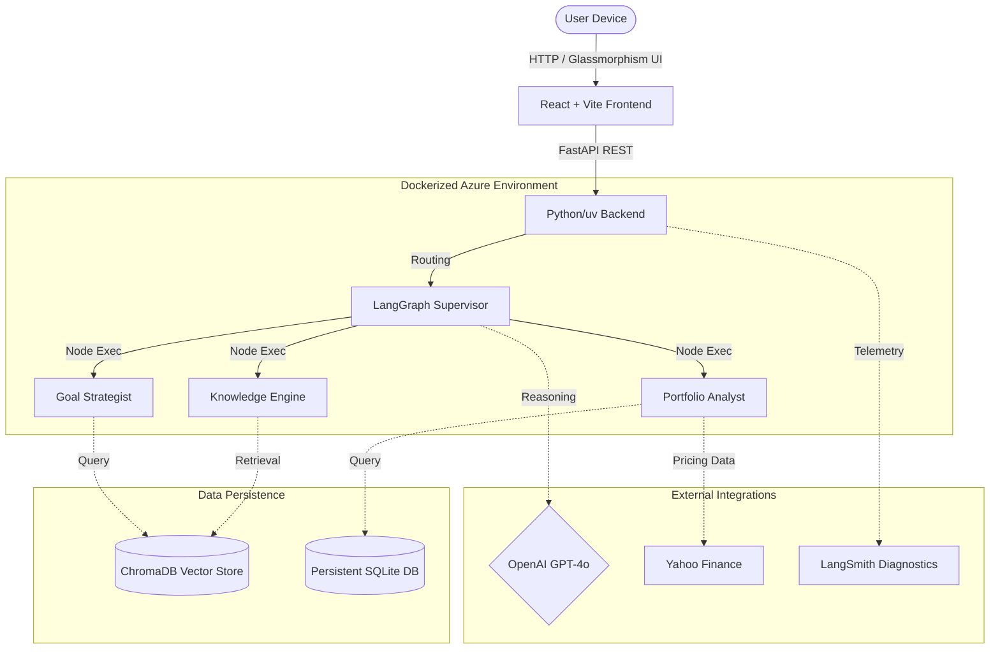

# Finnie AI: A Multi-Agent Finance Guide

<p align="center">
  
  
  
  
  
  
  
  
  
  
  
  
</p>

## 🧠 What is Finnie AI?

Finnie AI is a premium, production-grade financial assistant that delivers personalized advice, real-time market insights, and multi-currency portfolio analysis using a highly specialized multi-agent system built with LangGraph.

Instead of relying on a single underlying chat model, Finnie uses a **Supervisor Routing Architecture**. When a user submits a query, the Supervisor analyzes the intent and explicitly routes the task to specialized sub-agents:
- **Financial Q&A Agent**: Retrieves complex tax and investing theory directly from ChromaDB.
- **Portfolio Analyst Agent**: Securely reads the user's local SQLite holdings and executes live algorithmic calculations against Yahoo Finance market data.
- **Goal Strategist Agent**: Calculates multi-decade Monte Carlo simulations to plot safe retirement horizons.

### High-Level Architecture


---

## 🚀 Complete Setup Guide

Follow these steps in exact order to configure, ingest data, and launch both the backend and frontend of Finnie AI on your local machine.

### Step 1: Core Backend Setup
Finnie AI uses **[uv](https://docs.astral.sh/uv/)**—a lightning-fast Python package manager.

1. **Install uv** (one-time setup if you don't have it):
   ```bash
   brew install uv
   ```
2. **Sync Dependencies**:
   ```bash
   cd backend
   uv sync
   ```
3. **Set your Environment**:
   Duplicate `.env.example` to `.env` and fill in your keys (OpenAI, LangSmith, AlphaVantage, etc.):
   ```bash
   cp .env.example .env
   ```

---

### Step 2: Data Ingestion (ChromaDB Vector Store)

Finnie relies on three distinct "Knowledge Bases" stored in ChromaDB to provide theoretically grounded RAG answers. You must ingest this data before the agents can function properly.

We have built a flexible routing system allowing you to test locally for free, or push to the Cloud.

#### Option A: Ingesting to Local Disk (Default)
If you want to save the databases strictly to a hidden folder on your hard drive (`chroma_data_local`):
```bash
# Ingest definitions & introductory data
uv run python scripts/ingest/investor_gov_scraper.py --db local --reset

# Ingest deep theoretical and analytical benchmarks
uv run python scripts/ingest/load_html_analytical_kb.py --db local --reset

# Ingest 2026 US IRS & India Tax Rules for Goal Planning
uv run python scripts/ingest/ingest_regulatory_kb.py --db local --reset
```

> **Note**: The `--reset` flag ensures that if you run the script multiple times, it deletes the old collection before re-uploading, preventing duplicate chunks!

#### Option B: Ingesting to ChromaDB Cloud (Production)
If you want to view and manage these collections on your web dashboard, you must provide your `CHROMA_API_KEY` in `.env` and use the `--db cloud` flag:
```bash
uv run python scripts/ingest/investor_gov_scraper.py --db cloud --reset
uv run python scripts/ingest/load_html_analytical_kb.py --db cloud --reset
uv run python scripts/ingest/ingest_regulatory_kb.py --db cloud --reset
```

---

### Step 3: Starting the Backend Application

Once your data is successfully ingested, boot the FastAPI server to expose the Multi-Agent orchestrator.

```bash
# Ensure you are still in the backend folder
uv run uvicorn main:app --reload --port 8000
```
*The backend is now actively listening on `http://localhost:8000`.*

---

### Step 4: Testing Agents as Standalone (CLI)

You can test the core LangGraph reasoning engines directly via the terminal without needing the frontend. Open a **new terminal tab** and run:

```bash
cd backend

# Test the core Supervisor routing and RAG Q&A
uv run python tests/test_graph.py

# Alternatively, test specific endpoints via cURL
curl -X POST http://localhost:8000/chat \
  -H "Content-Type: application/json" \
  -d '{"message": "Explain the Sharpe Ratio to me."}'
```
*You should see detailed Trace IDs and agent hand-offs print directly in your server logs!*

---

### Step 5: Starting the Frontend App

The frontend is a gorgeous, responsive React + Vite application styled with Vanilla CSS `glass-morphism` tokens.

Open a **new terminal tab**:
```bash
cd frontend

# Install Node dependencies (first time only)
npm install

# Start the Vite development server
npm run dev
```

---

### Step 6: Testing End-to-End via Browser

Your full-stack application is now online!

Open your web browser and navigate to:
👉 **`http://localhost:5173`**

You can now test all features natively:
1. **Executive Edge (Dashboard)**: Automatically fetches live `yfinance` S&P 500 equivalent data for dynamic wealth tracking.
2. **My Holdings**: Add sample stocks (`AAPL`, `RELIANCE.NS`) into your SQLite database.
3. **Portfolio Analyst**: Triggers the AI to compute live Beta & Volatility algorithms against your holdings.
4. **Market Insights**: Fetches real-time sentiment analysis from Alpha Vantage.
5. **Goal Planner**: Runs 10,000-scenario Monte Carlo simulations cross-referenced against your RAG-ingested tax rules!

---

## 📂 Core Architecture Documentation

If you want to dive deeper into how specific features were engineered, check the `docs/` folder:

| Document | Purpose |
|---|---|
| [PROJECT_PLAN.md](./docs/PROJECT_PLAN.md) | Mission, features, and full roadmap |
| [DESIGN.md](./docs/DESIGN.md) | Multi-Agent LangGraph architecture map |
| [OBSERVABILITY_GUIDE.md](./docs/OBSERVABILITY_GUIDE.md) | LangSmith Tracing & FastAPI Middleware docs |
| [DASHBOARD.md](./docs/DASHBOARD.md) | The deterministic dynamic Global Wealth system |
| [RAG_GUIDE.md](./docs/RAG_GUIDE.md) | Semantic chunking and retrieval strategy |
| [UI_DESIGN.md](./docs/UI_DESIGN.md) | Glass-Finance UX/UI specification |
| [STANDARDS.md](./docs/STANDARDS.md) | Engineering guidelines and AI policies |
