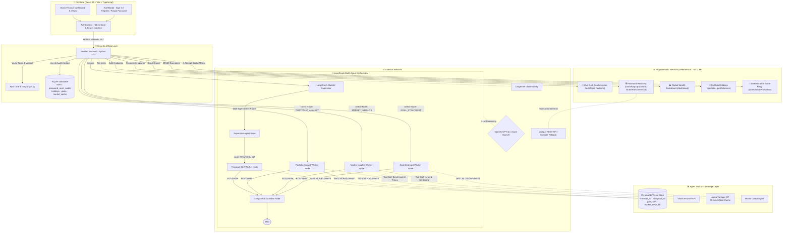

# Finnie AI: A Multi-Agent Finance Guide

<p align="center">
  
  
  
  
  
  
  
  
  
  
  
  
  
  
  
</p>

## 🧠 What is Finnie AI?

Finnie AI is a premium, production-grade financial assistant that delivers personalized advice, real-time market insights, and multi-currency portfolio analysis using a highly specialized multi-agent system built with LangGraph.

Instead of relying on a single underlying chat model, Finnie uses a **Supervisor Routing Architecture**. When a user submits a query, the Supervisor analyzes the intent and explicitly routes the task to specialized sub-agents:
- **Financial Q&A Agent**: Retrieves complex tax and investing theory directly from ChromaDB.
- **Portfolio Analyst Agent**: Securely reads the user's local SQLite holdings and executes live algorithmic calculations against Yahoo Finance market data.
- **Goal Strategist Agent**: Calculates multi-decade Monte Carlo simulations to plot safe retirement horizons.

### High-Level Architecture & Agent-vs-Programmatic Functionality Breakdown



### 📊 Functionality & Execution Breakdown

| Functionality | Primary Endpoint | Execution Mode | Agent Model | Tool Calls Required | Description |
|---|---|---|---|---|---|
| **User Auth & Profile** | `/auth/register`<br/>`/auth/login`<br/>`/auth/me` | **Programmatic** | *None (No LLM)* | *None* | Fast, deterministic JWT generation, password hashing (`bcrypt`), and user profile persistence. |
| **Password Recovery** | `/auth/forgot-password`<br/>`/auth/reset-password` | **Programmatic** | *None (No LLM)* | *Mailgun REST API* | 6-digit CSPRNG OTP, sliding rate-limiting (3/15m), strict 3-attempt limit, dual-origin audit trail (`password_reset_audits`), and session revocation (`token_version`). |
| **Global Wealth View** | `/dashboard` | **Programmatic** | *None (No LLM)* | *yfinance price lookup* | Lightning-fast deterministic SQLite crunching and live market prices without LLM latency. |
| **My Holdings CRUD** | `/portfolio`<br/>`/portfolio/save` | **Programmatic** | *None (No LLM)* | *None* | Multi-tenant portfolio CRUD operations with user isolation. |
| **Diversification Score Tile Retry** | `/portfolio/diversification` | **Programmatic** | *None (No LLM)* | *yfinance sector info (3 retries)* | 3-attempt exponential backoff engine for sector Herfindahl-Hirschman Index (HHI) score. Shows manual retry button on tile if retries fail. |
| **Deep Q&A Chat** | `/chat` | **AI Agentic** | **Multi-Agent Router** | ChromaDB RAG search | Supervisor Agent routes intent to Financial Q&A Agent → RAG search → Compliance Agent. |
| **Portfolio Analyst** | `/portfolio/analysis` | **AI Agentic** | **Multi-Agent (Country-Aware)** | Benchmark routing + yfinance + ChromaDB RAG | Calculates Beta/Volatility/HHI, conducts 2-pass RAG, and synthesizes 3-card formatted insights. |
| **Market Insights** | `/market/news` | **AI Agentic** | **Single Agent** | Alpha Vantage API + 30-min SQLite Cache | Direct route to Market Insights Agent for stock news & sentiment analysis. |
| **Goal Planner** | `/goals/calculate` | **AI Agentic** | **Single Agent** | 10,000 Monte Carlo simulations + ChromaDB Tax RAG | Direct route to Goal Strategist Agent for retirement roadmap generation. |


> 👁️ **Curious what it looks like?** Check out the [UI Preview Gallery](./docs/UI_PREVIEW.md) to see high-fidelity mockups of the finished Dashboard and Market Insights interfaces before you start the installation!

---

## 🚀 Complete Setup Guide

Follow these steps in exact order to configure, ingest data, and launch both the backend and frontend of Finnie AI on your local machine.

### Step 1: Core Backend Setup
Finnie AI uses **[uv](https://docs.astral.sh/uv/)**—a lightning-fast Python package manager.

1. **Install uv** (one-time setup if you don't have it):
   ```bash
   brew install uv
   ```
2. **Sync Dependencies**:
   ```bash
   cd backend
   uv sync
   ```
3. **Set your Environment**:
   Duplicate `.env.example` to `.env` and fill in your keys (OpenAI, LangSmith, AlphaVantage, etc.):
   ```bash
   cp .env.example .env
   ```

---

### Step 2: Data Ingestion (ChromaDB Vector Store)

Finnie relies on three distinct "Knowledge Bases" stored in ChromaDB to provide theoretically grounded RAG answers. You must ingest this data before the agents can function properly.

We have built a flexible routing system allowing you to test locally for free, or push to the Cloud.

#### Option A: Ingesting to Local Disk (Default)
If you want to save the databases strictly to a hidden folder on your hard drive (`chroma_data_local`):
```bash
# Ingest definitions & introductory data
uv run python scripts/ingest/investor_gov_scraper.py --db local --reset

# Ingest deep theoretical and analytical benchmarks
uv run python scripts/ingest/load_html_analytical_kb.py --db local --reset

# Ingest 2026 US IRS & India Tax Rules for Goal Planning
uv run python scripts/ingest/ingest_regulatory_kb.py --db local --reset
```

> **Note**: The `--reset` flag ensures that if you run the script multiple times, it deletes the old collection before re-uploading, preventing duplicate chunks!

#### Option B: Ingesting to ChromaDB Cloud (Production)
If you want to view and manage these collections on your web dashboard, you must provide your `CHROMA_API_KEY` in `.env` and use the `--db cloud` flag:
```bash
uv run python scripts/ingest/investor_gov_scraper.py --db cloud --reset
uv run python scripts/ingest/load_html_analytical_kb.py --db cloud --reset
uv run python scripts/ingest/ingest_regulatory_kb.py --db cloud --reset
```

---

### Step 3: Starting the Backend Application

Once your data is successfully ingested, boot the FastAPI server to expose the Multi-Agent orchestrator.

```bash
# Ensure you are still in the backend folder
uv run uvicorn main:app --reload --port 8000
```
*The backend is now actively listening on `http://localhost:8000`.*

---

### Step 4: Testing Agents as Standalone (CLI)

You can test the core LangGraph reasoning engines directly via the terminal without needing the frontend. Open a **new terminal tab** and run:

```bash
cd backend

# Test the core Supervisor routing and RAG Q&A
uv run python tests/test_graph.py

# Alternatively, test specific endpoints via cURL
curl -X POST http://localhost:8000/chat \
  -H "Content-Type: application/json" \
  -d '{"message": "Explain the Sharpe Ratio to me."}'
```
*You should see detailed Trace IDs and agent hand-offs print directly in your server logs!*

---

### Step 5: Starting the Frontend App

The frontend is a gorgeous, responsive React + Vite application styled with Vanilla CSS `glass-morphism` tokens.

Open a **new terminal tab**:
```bash
cd frontend

# Install Node dependencies (first time only)
npm install

# Start the Vite development server
npm run dev
```

---

### Step 6: Testing End-to-End via Browser

Your full-stack application is now online!

Open your web browser and navigate to:
👉 **`http://localhost:5173`**

You can now test all features natively:
1. **Executive Edge (Dashboard)**: Automatically fetches live `yfinance` market data for dynamic multi-country wealth tracking.
2. **My Holdings**: Add sample stocks (`AAPL`, `RELIANCE.NS`, etc.) grouped by country into your SQLite database.
3. **Portfolio Analyst**: Features country-specific benchmark routing (`^GSPC` for US, `^NSEI` for India, `^FTSE` for UK, etc.), All-Markets combined view, formatted 3-card AI insights, instant session caching, and manual "Refresh Analysis" button.
4. **Market Insights**: Fetches real-time sentiment analysis from Alpha Vantage with persistent 30-minute SQLite caching.
5. **Goal Planner**: Runs 10,000-scenario Monte Carlo simulations cross-referenced against your RAG-ingested tax rules!

---

## 📂 Core Architecture Documentation

If you want to dive deeper into how specific features were engineered, check the streamlined documentation suite:

| Document | Focus Area | Contents & Implementation Details |
|---|---|---|
| [**AGENTS.md**](./AGENTS.md) | Universal Agent Constitution | Coding standards, 4-space/2-space indentation rules, and feature lifecycles |
| [**specs/**](./specs/) | Spec-Driven Development (SDD) | Baseline verified specs (SPEC-01 to 05) & upcoming feature spec templates |
| [**FEATURES_AND_AGENTS.md**](./docs/FEATURES_AND_AGENTS.md) | Feature Intelligence | Technical & functional specifications for all 5 core features and agent nodes |
| [**ARCHITECTURE.md**](./docs/ARCHITECTURE.md) | System Architecture | LangGraph hub-and-spoke topologies, state schemas, and LangSmith observability |
| [**KNOWLEDGE_BASE_AND_RAG.md**](./docs/KNOWLEDGE_BASE_AND_RAG.md) | Grounding & Vectors | ChromaDB 3-collection strategy, embeddings factory, and scraping pipelines |
| [**UI_DESIGN_SYSTEM.md**](./docs/UI_DESIGN_SYSTEM.md) | Glass-Finance UX | Design tokens, custom hook architecture, `RoadmapRenderer`, and design standards |
| [**UI_PREVIEW.md**](./docs/UI_PREVIEW.md) | Visual UI Gallery | High-fidelity screenshots for all 6 workspace dashboards and agent views |
| [**DEPLOYMENT.md**](./docs/DEPLOYMENT.md) | Cloud & Containers | Multi-worker Gunicorn Docker setup, persistent mounts, and Azure deployment |
| [**PROGRESS_LOG.md**](./docs/PROGRESS_LOG.md) | Progress & Changelog | Date-stamped accomplishment logs, phase completions, and test records |
| [**PROJECT_PLAN.md**](./docs/PROJECT_PLAN.md) | Product Roadmap | Strategic vision, future analytical use-cases (UC-PA-1 through UC-PA-6) |
| [**CODE_REVIEW.md**](./docs/CODE_REVIEW.md) | Technical Debt & Audit | Senior engineering review and prioritized improvement roadmap |

