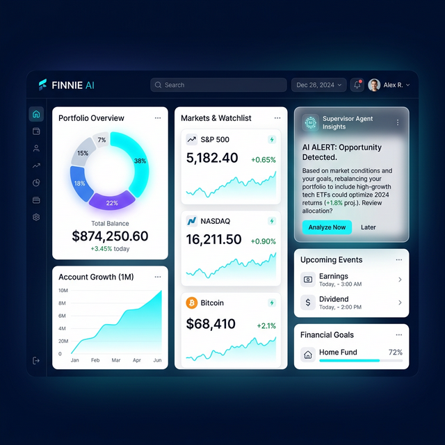

# Finnie AI: UI Design & UX Brainstorming

This document outlines the visual structure and interaction model for Finnie AI, focusing on the **"Glass-Finance"** aesthetic.

## 1. Visual Language: "Glass-Finance"
- **Background**: Deep carbon/navy gradient (`#05060a` to `#0f111a`).
- **Surface**: White glassmorphism cards (High blur, low-opacity white border).
- **Accents**: Neon Cyan (`#00f5ff`) for AI actions, Emerald Green for gains, and Sunset Orange for risks.
## 2. Visual Framework (Consistent Web View)
To ensure a premium, unified experience, all screens follow a **16:9 Web-First Responsive Layout** with the following rigid constraints:

- **Sidebar**: Persistent, left-aligned translucent sidebar (`width: 240px`) with blur-active active states.
- **Header**: Global top-bar with search and "Discovery Agent" live ticker.
- **Grid System**: Standard 12-column grid for consistent card alignment.
- **Theming**: Strict adherence to `#05060a` background and high-blur (`20px`) glassmorphism surfaces.

### 2.1 Executive Dashboard

> [!NOTE]
> All subsequent screens (Builder, Insights, Goals) follow the exact visual structure and color palette of the Executive Dashboard shown above to ensure 100% thematic consistency.

---

## 3. Core Navigation & Use Cases

### 3.1 Initial Onboarding: The "Portfolio Builder" (First-Time User)
When a user logs in with no data, they are met with a high-impact onboarding flow.
- **Hero Card**: "Welcome to Finnie AI. Let's build your financial foundation."
- **Builder Interface**: 
    - **Asset Search**: A glassmorphism search bar to add stocks/crypto.
    - **Manual Entry**: Fields for "Quantity" and "Purchase Price".
    - **AI Suggestion**: "New to investing? The *Discovery Agent* suggests starting with a diversified Index Fund like VOO."

### 3.2 Q&A Chatbot (Conversational Intelligence)
- **Interface**: Immersive chat with agent-specific orbs/icons.
- **Rich Cards**: Answers aren't just text; they include mini-charts or table data when relevant.
- **Compliance Footer**: Persistent disclaimer: *"Finnie is an AI assistant, not a financial advisor. $NFA."*

### 3.3 Portfolio Analysis (Deep Metrics)
- **Visuals**: Donut chart for allocation, risk/return scatter plots.
- **Insights**: Textual summaries like *"Your tech exposure is 45%, which is high for your moderate risk profile."*

### 3.4 Market Insights (Real-Time Context)
- **Watchlist**: Sleek sparklines for user-tracked assets.
- **Agent Explanation**: A "Why is this moving?" button that triggers the *Market Insights Agent* to fetch recent news and explain price action.

### 3.5 Goal Planning (Success Projections)
- **Interactive Projections**: A fan chart showing probability spreads.
- **What-If Sliders**: Sliders for monthly savings and target years that re-run Monte Carlo simulations instantly.
- **Compliance Validation**: Goal projections include mandatory risk-level disclosures.

---

## 3. Interaction Design
- **Agent Thinking States**: Subtle pulse on the border of a card when its relevant agent is fetching data.
- **Tab Transitions**: Smooth horizontal sliding animations using Framer Motion.
- **Haptic-Feedback (Visual)**: Subtle button scale-down on click to feel tactile.
