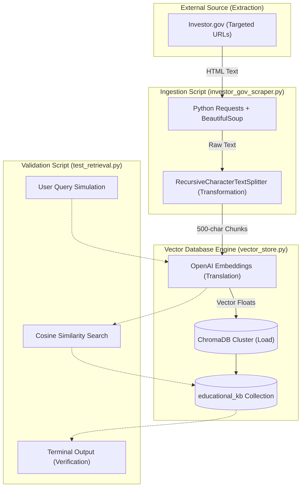

# Finnie AI: RAG Ingestion Pipeline (Phase 1)
**Developer Technical Guide & Architecture**

This guide provides a comprehensive, step-by-step technical walkthrough of the **Intelligence & Data Grounding** phase of Finnie AI. It is designed to help new developers understand how the foundational knowledge base is collected, processed, and validated before it is connected to the LangGraph autonomous agents.

---

## 🏗️ Architecture & Component Flow

The ingestion pipeline follows an **Extract, Transform, Load (ETL)** pattern, tailored for AI Retrieval-Augmented Generation (RAG).



---

## 🛠️ Step-by-Step Component Breakdown

### 1. Extraction: The Scraper (`investor_gov_scraper.py`)
**Goal:** Pull targeted, highly accurate financial definitions directly from a government-regulated source (Investor.gov) rather than a commercial or Wikipedia-style site like Investopedia. This aligns with Finnie's Phase 4 Compliance Guardian requirements.

*   **Mechanism:** We use a simple web crawler constructed with the Python `requests` library and parsed using `BeautifulSoup`.
*   **Depth Strategy:** We use a strict **Depth 1 Strategy**. We define a dictionary of exact term slugs (e.g., `"mutual-funds"`) and fetch only the body text of those exact definition pages. The script explicitly ignores child links to avoid polluting the database with irrelevant tangental context (context bloat).

### 2. Transformation: The Splitter
**Goal:** Language Models perform best when given small, dense pockets of information to reason over, rather than entire web pages.

*   **Mechanism:** The raw scraped text strings are passed through LangChain's `RecursiveCharacterTextSplitter`.
*   **Configuration:** The text is partitioned into strict "Chunks." We use a conservative `chunk_size` of 500 characters, with an overlap of 50 characters between chunks to prevent sentences from being violently cut in half.

### 3. Translation & Load: The Vector Store Manager (`vector_store.py`)
**Goal:** Convert human language into mathematical arrays (vectors) that a computer can rapidly compare for "similarity."

*   **Embeddings Engine**: The script takes the 500-character string chunks and passes them through an Embedding Model.
    *   *Development Note:* The `VectorStoreManager` is intentionally designed with a fallback mechanism. If no valid `OPENAI_API_KEY` is present in the environment (or if it's set to `"dummy_key_for_testing"`), the system natively falls back to `FakeEmbeddings`. This allows local developers to run the pipeline offline and for free.
*   **Storage Framework:** The mathematical vectors (and the original text as metadata) are persistently saved to the local disk in a folder named `backend/chroma_db` using the **ChromaDB** framework. Specifically, the definitions are routed into the `educational_kb` collection.

### 4. Verification: The Retrieval Test (`test_retrieval.py`)
**Goal:** Prove that the Chunking limits and the Embedded Math actually work *before* wiring up an expensive LLM.

*   **Mechanism:** This interactive CLI script takes a human query via the terminal (e.g., `"What is an ETF?"`), vectorizes the question using the precise exact same model used for ingestion, and asks ChromaDB to return the top `k=3` most mathematically similar chunks.
*   **Result:** A human developer reads the terminal output to manually audit the "Context Precision" of the Database. If the returned chunks accurately answer the question, the pipeline is viable!

---

## 🚀 Local Setup & Execution Instructions

If you are a new developer setting up this environment for the first time, run the following commands sequentially to build the vector database on your local machine.

### Prerequisites
Make sure you have Python 3 installed and you are navigating to the `/backend` directory of the project in your terminal.

```bash
# 1. Navigate to the backend directory
cd /Users/prajosh/Development/finnie-ai/backend

# 2. Create and activate an isolated Python Virtual Environment
python3 -m venv venv
source venv/bin/activate

# 3. Install the required RAG dependencies (LangChain, ChromaDB, etc.)
pip install -r requirements.txt
```

### Running the Pipeline

**Step 1: Execute the Ingestion (Scraping) Script**
We need to populate the database with definitions. This command sets a dummy OpenAI key to trigger the `FakeEmbeddings` fallback logic for local, offline development.

```bash
export OPENAI_API_KEY="dummy_key_for_testing" \
export CHROMA_USER_AGENT="finnie-ai" \
python3 scripts/ingest/investor_gov_scraper.py
```
*Expected Output:* You should see terminal logs indicating 15 terms were scraped and 22 chunks successfully added to ChromaDB.

**Step 2: Execute the Retrieval Validation Test**
Now, verify the system can look up facts. Pick a term we scraped (like "ETF", "Bonds", or "Inflation").

```bash
export OPENAI_API_KEY="dummy_key_for_testing" \
export CHROMA_USER_AGENT="finnie-ai" \
python3 scripts/test_retrieval.py "How does an Index Fund work?"
```
*Expected Output:* The terminal will print out the top 3 chunks retrieved from the database. Read the text to verify they accurately explain what an Index Fund is based on the Investor.gov data.
