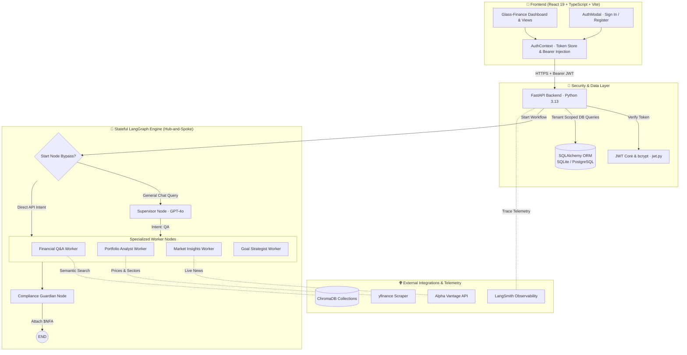
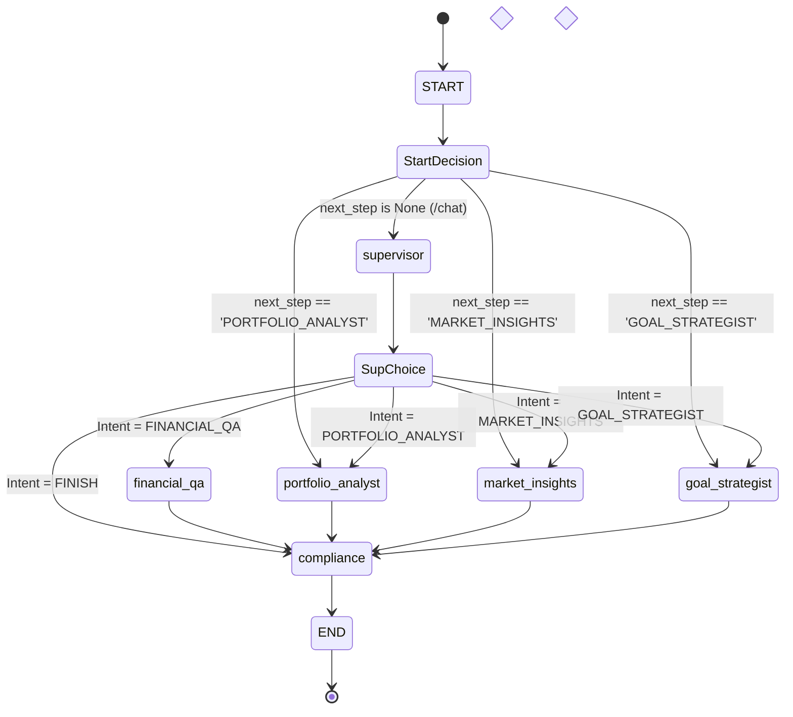

# Finnie AI — System Architecture & Multi-Agent Design

This document is the authoritative engineering specification for Finnie AI's stateful LangGraph multi-agent orchestrator, multi-tenant security layer, and telemetry infrastructure.

---

## 1. 🎯 Business Context & Architectural Vision

- **Mission**: Deliver institutional-grade financial guidance for retail investors through a **"Dashboard-First, Agent-Assisted"** experience.
- **Architectural Pillars**:
  1. **Speed vs Reasoning Split**: Deterministic high-speed workflows (Dashboard P&L, holdings management) bypass the LLM completely to eliminate cost and latency.
  2. **Multi-Tenant Data Isolation**: Strict user-level boundary isolation across every database entity and agent node.
  3. **Regulatory Safety as a Gateway**: Architectural guarantee that no financial advice response can reach a user without SEC/FINRA `$NFA` disclaimer enforcement.
  4. **Vendor Agnosticism (12-Factor App)**: Runs seamlessly on local SQLite or managed PostgreSQL, and supports OpenAI, Azure OpenAI, or open-weight Hugging Face models via factories.

---

## 2. 🏗️ Diagrammatic Architectural Representation

### A. End-to-End System Topography



### B. The LangGraph Hub-and-Spoke Routing Flow



---

## 3. ⚙️ Detailed Technical Implementation

### A. Graph Memory (`FinnieState`)
The state is a typed POJO passed between all nodes:

```python
class FinnieState(TypedDict):
    messages:           Annotated[list[AnyMessage], add_messages]
    portfolio_data:     Optional[list[dict]]    # [{ticker, shares, exchange, country}]
    analysis_results:   Optional[dict]          # {beta, volatility, diversification_score, ...}
    market_context:     Optional[dict]
    goal_configuration: Optional[dict]          # {target_amount, target_year, country, ...}
    next_step:          Optional[str]
    trace_id:           Optional[str]
    analysis_country:   Optional[str]           # "US" | "IN" | "ALL"
    user_id:            Optional[str]           # Authenticated tenant UUID
```

### B. Stateless Multi-Tenant Authentication
- Tokens are signed using `HMAC-SHA256` via `python-jose`.
- Password verification bypasses `passlib` to directly invoke `bcrypt` (ensuring compatibility with Python 3.13).
- Endpoints inject `current_user: User = Depends(get_current_user)` and derive `effective_id = current_user.id`.

### C. Observability & Telemetry Infrastructure
- Every request generates a unique `trace_id` propagated via FastAPI `TraceContextMiddleware`.
- LangSmith Tracing automatically tags executions with `user_id` and intent for audit compliance.

---

## 4. 🛡️ Resilience, Edge Cases & Verification

- **Sync/Async Node Uniformity**: All LangGraph node functions are synchronous (`def node(state: FinnieState) -> dict`) to prevent async event-loop deadlocks.
- **Verification Commands**:
  - Run complete unit test suite: `uv run python -m unittest discover -s tests`
  - Verify routing logic offline: `test_route_decision` and `test_start_node_bypass` in `tests/test_unit.py`.
