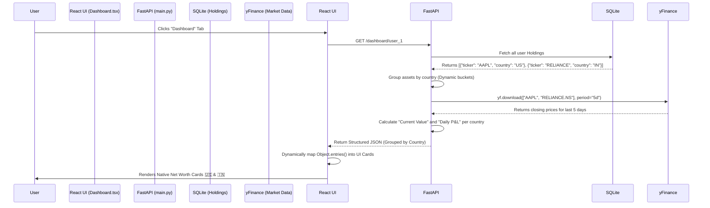

# Global Wealth Dashboard: Technical Design Specification

> **Status:** 📐 Design Phase | **Target:** Phase 5 (Executive Dashboard)

Finnie's Executive Dashboard acts as the absolute "source of truth" for the user's localized net worth. Unlike the AI Agent nodes (which are optimized for reasoning and text generation), the Dashboard is optimized purely for speed and data aggregation.

It securely loads the user's fragmented portfolio from SQLite, organizes it by geography, and calculates real-time valuations using Yahoo Finance (`yfinance`), completely bypassing LLM latency.

---

## 🏗️ 1. Architecture Flow



## 🗄️ 2. API Contract: `GET /dashboard/{user_id}`

To prevent the frontend from managing complex loops and math arrays, the backend will resolve all calculations and return a pre-formatted payload. Note how the countries (`US`, `IN`) are dynamic object keys, meaning a `UK` portfolio would instantly render without code changes.

```json
{
  "total_assets": 5,
  "total_countries": 2,
  "portfolios": {
    "US": {
      "country_code": "US",
      "total_value": 45000.50,
      "daily_pnl": 340.20,
      "daily_pnl_percent": 0.76,
      "assets": [
        {
          "ticker": "AAPL",
          "shares": 100,
          "current_price": 150.00,
          "prev_close": 145.00,
          "asset_pnl": 500.00,
          "asset_pnl_percent": 3.44
        }
      ]
    },
    "IN": {
      "country_code": "IN",
      "total_value": 850000.00,
      "daily_pnl": -12000.00,
      "daily_pnl_percent": -1.39,
      "assets": [ ... ]
    }
  }
}
```

## ⚛️ 3. Frontend Architecture

The layout will consist of two primary visual layers.

### Layer 1: The Executive Header (Vanity Metrics)
- A brief greeting ("Welcome to your Global Portfolio").
- A "Vanity Metric" pill reading: `"You own {total_assets} unique assets across {total_countries} international markets."`

### Layer 2: The Native Geographic Grids
React will iterate over `Object.values(portfolios)` to spit out unified modules containing:
1.  **The Net Worth Card**: A massive UI block showing the absolute total value of the country's sub-portfolio. Includes a colored badge (`var(--accent-cyan)` or Red) indicating exactly how much money was gained/lost in the last 24 hours.
2.  **The Localized Table**: A data grid below the Wealth Card containing the granular line-items (`Ticker`, `Shares`, `Current Price`, `Change`) specific to that geography.

## ⚠️ 4. Boundary Cases & Error Handling

1.  **Empty Portfolios**: If SQLite returns `0` records, the FastAPI endpoint immediately returns `{"total_assets": 0, "portfolios": {}}`. The UI will display a blank-slate screen directing the user to the "My Holdings" tab.
2.  **Market Holidays / Weekends**: The `yfinance` history fetches `period="5d"`. This guarantees we bypass weekends and public holidays to find the absolute latest "Current Price" and the immediate "Previous Close" for accurate P&L math.
3.  **Delisted/Invalid Tickers**: If a user enters an asset that cannot be priced, the Python logic will catch the `NaN` and assign a `$0.00` valuation to that specific asset row, appending an `"error": true` flag to the JSON.
4.  **Symbol Suffixes**: The engine joins the raw `ticker` string with the `MarketExchange` table mapping to append the correct geographic identifier (e.g., `.NS` for India) before requesting the Live Quote, ensuring we don't accidentally price a US company with the same acronym.
