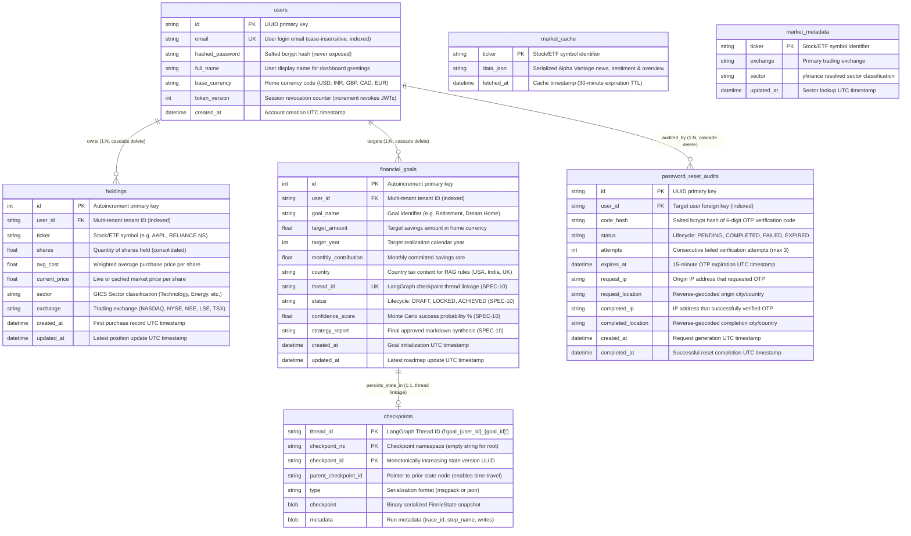

# Finnie AI — Canonical Database Architecture & Data Dictionary

> **Status**: 🟢 **CANONICAL ARCHITECTURAL SPECIFICATION**  
> **Target Audience**: All AI Agents (Antigravity, Cursor, Copilot) & Human Engineers  
> **Database Engines**: SQLite 3 (Local Development & Testing) · PostgreSQL 16+ (Azure Cloud Production)  
> **ORM Layer**: SQLAlchemy 2.0  
> **Last Updated**: September 27, 2026  

---

## 1. 🏛️ Overview & Dual-Engine Architecture

Finnie AI employs a **cloud-agnostic relational database architecture** managed through SQLAlchemy 2.0 ORM. The platform operates identically across two environments with zero business logic changes:

1. **Local Development & Offline Testing**:
   * Uses **SQLite 3** (`backend/finnie.db`) with Write-Ahead Logging (`WAL` mode).
   * Fast, zero-configuration, and fully self-contained in a single file.
2. **Azure Cloud Production**:
   * Uses **Azure Database for PostgreSQL (Flexible Server)** via standard connection strings (`DATABASE_URL=postgresql+psycopg2://...`).
   * Connection pooling, ACID transaction isolation, and horizontal multi-worker scalability.

### Mandatory Agent Invariant
> [!IMPORTANT]
> **ANY** modification to database models, table columns, indexes, foreign keys, or constraints MUST be documented in this file first before altering code in `backend/src/models/`.

---

## 2. 🗺️ Annotated Entity-Relationship (ER) Diagram

Below is the complete system Entity-Relationship diagram. Every column includes an inline annotation explaining its role, and each relationship explicitly defines foreign key constraints and cardinality.



---

## 3. 📖 Detailed Table-by-Table Data Dictionary

### Table 1: `users`
* **File Location**: `backend/src/models/user.py`
* **Purpose**: Core authentication, identity, tenant definition, and active session management.

| Column Name | Type | Constraints | Purpose & Domain Rule | Security / PII |
| :--- | :--- | :--- | :--- | :--- |
| `id` | `VARCHAR(36)` | **PK**, Not Null | Randomly generated UUID string identifying the tenant. | Internal ID |
| `email` | `VARCHAR(255)` | **Unique**, Index, Not Null | Login identifier. Sanitized to lowercase on registration and login. | **PII (Mask in logs)** |
| `hashed_password`| `VARCHAR(255)` | Not Null | Salted bcrypt hash generated using `bcrypt.hashpw`. Never exposed in API responses. | **Secret** |
| `full_name` | `VARCHAR(100)` | Nullable | User display name for dashboard greetings and email templates. | PII |
| `base_currency` | `VARCHAR(10)` | Default: `'USD'`, Not Null | Primary currency for net-worth calculation (`USD`, `INR`, `GBP`, `CAD`, `EUR`). | Preference |
| `token_version` | `INTEGER` | Default: `1`, Not Null | Active session revocation counter. Incrementing instantly revokes all prior JWT sessions. | Security Control |
| `created_at` | `TIMESTAMP` | Default: `UTC now` | Account registration audit timestamp. | Audit |

---

### Table 2: `holdings`
* **File Location**: `backend/src/models/portfolio.py`
* **Purpose**: Stores multi-market stock, ETF, and mutual fund positions owned by the user.

| Column Name | Type | Constraints | Purpose & Domain Rule | Security / Tenant |
| :--- | :--- | :--- | :--- | :--- |
| `id` | `INTEGER` | **PK**, Autoincrement | Internal sequence identifier. | Internal ID |
| `user_id` | `VARCHAR(36)` | **FK** (`users.id`), Index, Not Null | Multi-tenant tenant ID. Derived strictly from JWT token. | **Tenant Isolation** |
| `ticker` | `VARCHAR(30)` | Not Null | Asset symbol (e.g. `AAPL`, `VOO`, `RELIANCE.NS`, `VOD.L`). | Public Asset |
| `shares` | `FLOAT` | Not Null, Check: `> 0` | Total quantity of shares held. Defensive save sums duplicate ticker shares. | Financial Position |
| `avg_cost` | `FLOAT` | Default: `0.0`, Not Null | Weighted average purchase price per share in original currency. | Financial Position |
| `current_price` | `FLOAT` | Default: `0.0`, Not Null | Latest market price per share populated by yfinance. | Public Asset |
| `sector` | `VARCHAR(100)` | Nullable | GICS sector classification used by the HHI diversification engine. | Financial Domain |
| `exchange` | `VARCHAR(30)` | Default: `'US'`, Not Null | Exchange identifier used for currency and country routing (`US`, `NSE`, `LSE`). | Market Routing |
| `created_at` | `TIMESTAMP` | Default: `UTC now` | First position recording timestamp. | Audit |
| `updated_at` | `TIMESTAMP` | Default: `UTC now`, OnUpdate | Position update timestamp. | Audit |

* **Composite Unique Constraint**:
  ```python
  UniqueConstraint("user_id", "ticker", "exchange", name="uq_user_ticker_exchange")
  ```
  Prevents duplicate database rows for the same asset within a single user account.

---

### Table 3: `financial_goals`
* **File Location**: `backend/src/models/goal.py`
* **Purpose**: Stores user financial targets, Monte Carlo simulation outputs, approved roadmaps, and LangGraph checkpoint thread linkages.

| Column Name | Type | Constraints | Purpose & Domain Rule | Security / Tenant |
| :--- | :--- | :--- | :--- | :--- |
| `id` | `INTEGER` | **PK**, Autoincrement | Internal sequence identifier. | Internal ID |
| `user_id` | `VARCHAR(36)` | **FK** (`users.id`), Index, Not Null | Multi-tenant tenant ID. Derived strictly from JWT token. | **Tenant Isolation** |
| `goal_name` | `VARCHAR(100)` | Default: `'Retirement'`, Not Null | Human-readable goal name (`Retirement 2045`, `Dream Home`). | User Input |
| `target_amount` | `FLOAT` | Not Null, Check: `> 0` | Target savings goal in user's home currency. | Financial Target |
| `target_year` | `INTEGER` | Not Null, Check: `ge 2026` | Realization calendar year. Must be $\ge \text{current year}$. | Financial Target |
| `monthly_contribution` | `FLOAT` | Default: `0.0`, Check: `ge 0` | Committed monthly savings rate. | Financial Target |
| `country` | `VARCHAR(50)` | Default: `'USA'`, Not Null | Jurisdiction context determining tax limits (USA, India, UK, etc.). | Tax Domain |
| `thread_id` | `VARCHAR(100)` | **Unique**, Index, Nullable | LangGraph checkpoint thread identifier (`f"goal_{user_id}_{goal_id}"`). | **SPEC-10 Memory Link** |
| `status` | `VARCHAR(20)` | Default: `'LOCKED'`, Not Null | Goal lifecycle state: `DRAFT`, `LOCKED`, `ACHIEVED`. | **SPEC-10 Lifecycle** |
| `confidence_score` | `FLOAT` | Nullable, Range: `0.0-100.0` | Monte Carlo probability of success percentage calculated by math engine. | Analytics Output |
| `strategy_report` | `TEXT` | Nullable | Full markdown report synthesized by the Goal Strategist and approved in HITL. | Approved Synthesis |
| `created_at` | `TIMESTAMP` | Default: `UTC now` | Goal initialization timestamp. | Audit |
| `updated_at` | `TIMESTAMP` | Default: `UTC now`, OnUpdate | Latest goal modification timestamp. | Audit |

* **Composite Unique Constraint**:
  ```python
  UniqueConstraint("user_id", "goal_name", name="uq_user_goal_name")
  ```

---

### Table 4: `password_reset_audits`
* **File Location**: `backend/src/models/password_reset.py`
* **Purpose**: Forensic audit trail, brute-force defense, and rate-limiting telemetry for password recovery.

| Column Name | Type | Constraints | Purpose & Domain Rule | Security Classification |
| :--- | :--- | :--- | :--- | :--- |
| `id` | `VARCHAR(36)` | **PK**, Not Null | Randomly generated UUID string identifying the reset request. | Internal ID |
| `user_id` | `VARCHAR(36)` | **FK** (`users.id`), Index, Not Null | Target user requesting recovery. | **Tenant Isolation** |
| `code_hash` | `VARCHAR(255)` | Not Null | Salted bcrypt hash of 6-digit OTP verification code. Plaintext is never stored. | **Secret** |
| `status` | `VARCHAR(20)` | Default: `'PENDING'`, Not Null | Lifecycle state: `PENDING`, `COMPLETED`, `FAILED`, `EXPIRED`. | Security State |
| `attempts` | `INTEGER` | Default: `0`, Not Null | Failed OTP verification counter. On 3rd failure, status becomes `FAILED`. | Brute-Force Lockout |
| `expires_at` | `TIMESTAMP` | Not Null | UTC timestamp 15 minutes after request creation. | TTL Expiration |
| `request_ip` | `VARCHAR(45)` | Nullable | Origin IP address making the reset request. | Forensic Telemetry |
| `request_location`| `VARCHAR(100)` | Nullable | Reverse-geocoded city/country of origin request. | Forensic Telemetry |
| `completed_ip` | `VARCHAR(45)` | Nullable | IP address that submitted the valid OTP and new password. | Forensic Telemetry |
| `completed_location`| `VARCHAR(100)`| Nullable | Reverse-geocoded city/country of completion. | Forensic Telemetry |
| `created_at` | `TIMESTAMP` | Default: `UTC now` | Request creation timestamp. | Audit |
| `completed_at` | `TIMESTAMP` | Nullable | Successful reset completion timestamp. | Audit |

---

### Tables 5 & 6: `market_cache` & `market_metadata`
* **File Location**: `backend/src/models/market_cache.py`, `backend/src/models/market_metadata.py`
* **Purpose**: High-speed local caching to conserve external API credits (Alpha Vantage & yfinance).

| Table | Column | Type | Constraints | Purpose |
| :--- | :--- | :--- | :--- | :--- |
| `market_cache` | `ticker` | `VARCHAR(30)` | **PK** | Stock symbol identifier. |
| `market_cache` | `data_json` | `TEXT` | Not Null | Serialized news sentiment and company fundamentals. |
| `market_cache` | `fetched_at` | `TIMESTAMP` | Not Null | Cache timestamp. Valid for 30 minutes (`is_expired()`). |
| `market_metadata` | `ticker` | `VARCHAR(30)` | **PK** | Stock symbol identifier. |
| `market_metadata` | `exchange` | `VARCHAR(30)` | Nullable | Resolved exchange code. |
| `market_metadata` | `sector` | `VARCHAR(100)`| Nullable | Cached sector classification for HHI engine. |
| `market_metadata` | `updated_at` | `TIMESTAMP` | Default: `UTC now` | Metadata refresh timestamp. |

---

### Table 7: LangGraph Checkpointer Tables (`checkpoints`, `checkpoint_blobs`, `checkpoint_writes`)
* **Managed by**: `langgraph.checkpoint.sqlite.SqliteSaver` / `langgraph.checkpoint.postgres.PostgresSaver`
* **Colocation**: Stored directly in `finnie.db` (or production PostgreSQL schema).
* **Purpose**: Provides time-travel state persistence, thread-based multi-turn memory, and Human-in-the-Loop (HITL) interrupt capability.

| Table Name | Primary Keys | Key Columns | Purpose |
| :--- | :--- | :--- | :--- |
| `checkpoints` | `thread_id`, `checkpoint_ns`, `checkpoint_id` | `parent_checkpoint_id`, `type`, `checkpoint` (BLOB), `metadata` (BLOB) | Stores serialized `FinnieState` snapshots at every graph node boundary. |
| `checkpoint_blobs` | `thread_id`, `checkpoint_ns`, `channel`, `version` | `type`, `blob` (BLOB) | Stores state channel values that exceed standard inlined byte thresholds. |
| `checkpoint_writes`| `thread_id`, `checkpoint_ns`, `checkpoint_id`, `task_id`, `idx` | `channel`, `type`, `blob` (BLOB) | Pending writes and tasks queued during node transitions. |

---

## 4. 🔒 Multi-Tenant Isolation & Security Invariants

1. **No Client-Supplied User IDs**:
   * API endpoints MUST NEVER accept `user_id` from request bodies or URL path parameters to identify the active user.
   * `effective_id = current_user.id` must be injected via `Depends(get_current_user)`.
2. **Thread ID Prefix Validation (SPEC-10)**:
   * LangGraph thread IDs MUST be namespaced: `thread_id = f"goal_{user_id}_{goal_id}"`.
   * Any API request attempting to calculate, stream, or lock in a thread where `thread_id` does not begin with `f"goal_{current_user.id}_"` MUST be rejected with **`403 Forbidden`**.
3. **Database Composite Unique Constraints**:
   * Multi-tenant tables MUST use composite unique constraints (e.g. `(user_id, ticker, exchange)` in `holdings`, `(user_id, goal_name)` in `financial_goals`) to prevent accidental cross-tenant overwrites or duplicates.

---

## 5. 🔄 Zero-Downtime Database Migration Pattern

Finnie AI uses an **idempotent, automatic migration pattern** inside `init_db()` in `backend/src/database.py`.

### Migration Policy for Agents:
When adding new columns to existing tables:
1. Declare the column in the SQLAlchemy model with `nullable=True` or a safe `default` value.
2. In `init_db()`, query database table metadata using `inspector = inspect(engine)`.
3. Check if the column exists in `[col["name"] for col in inspector.get_columns(table_name)]`.
4. If missing, execute non-destructive DDL:
   ```python
   with engine.connect() as conn:
       conn.execute(text(f"ALTER TABLE {table_name} ADD COLUMN {col_name} {col_type}"))
       conn.commit()
   ```
5. **Never execute `DROP TABLE`** in production scripts. Existing user records, holdings, and goals must be preserved.

---

## 6. 🚀 Future Extensions: Reserved Table Schemas (SPEC-11 Hook)

To support **SPEC-11: Cross-Session Long-Term Episodic Memory (Mem0)** without schema conflicts, the following table namespace is formally reserved in `finnie.db`:

### Reserved Table: `user_memories` (Planned for Phase 9)
```sql
CREATE TABLE user_memories (
    id VARCHAR(36) PRIMARY KEY,
    user_id VARCHAR(36) NOT NULL,
    category VARCHAR(50) NOT NULL,    -- 'preference', 'milestone', 'constraint', 'tax'
    fact_key VARCHAR(100) NOT NULL,   -- 'risk_tolerance', 'child_college_year'
    fact_text TEXT NOT NULL,          -- "Prefers Vanguard index funds; avoids crypto"
    valid_from TIMESTAMP NOT NULL,
    valid_until TIMESTAMP,            -- NULL if currently active; set on contradiction update
    confidence_score FLOAT DEFAULT 1.0,
    created_at TIMESTAMP DEFAULT CURRENT_TIMESTAMP,
    updated_at TIMESTAMP DEFAULT CURRENT_TIMESTAMP,
    FOREIGN KEY (user_id) REFERENCES users(id) ON DELETE CASCADE
);
CREATE INDEX idx_user_memories_tenant ON user_memories(user_id, category);
```
