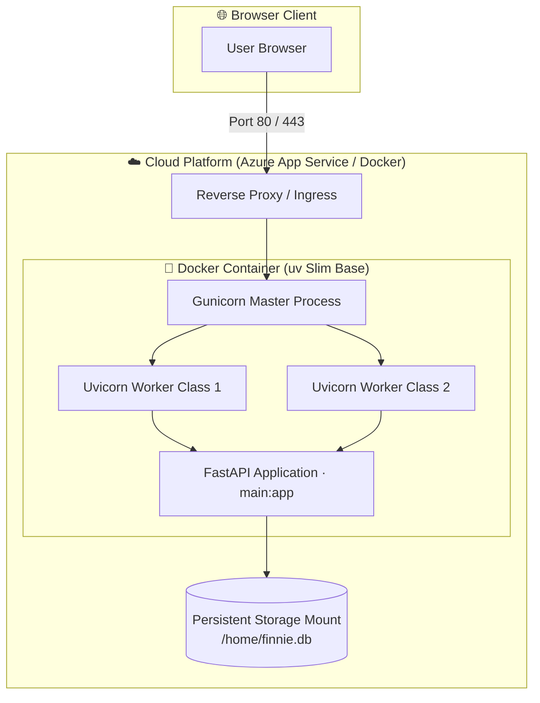

# Finnie AI — Deployment & Cloud Infrastructure Guide

This document is the authoritative guide for containerizing, configuring, and deploying Finnie AI to cloud infrastructure (Azure App Service, AWS Fargate, GCP Cloud Run, or Kubernetes).

---

## 1. 🎯 Business Context & Operational Rules

- **12-Factor App & Cloud-Native Philosophy**:
  - The application is vendor-agnostic and fully containerized using Docker.
  - Zero hardcoded credentials or environment-specific URLs.
  - Stateless scaling: JWT authentication allows scaling backend worker replicas horizontally across cloud instances.
- **Persistent Data**:
  - SQLite data file (`finnie.db`) is mounted on Azure persistent storage (`/home/finnie.db`).
  - Swapping to managed cloud PostgreSQL (e.g. Azure Database for PostgreSQL) requires only setting `DATABASE_URL` in environment variables with zero code changes.

---

## 2. 🏗️ Diagrammatic Architectural Representation



---

## 3. ⚙️ Detailed Technical Implementation

### A. Gunicorn Multi-Worker Container (`backend/Dockerfile`)
The backend is packaged using Astral's official `uv` slim image for minimal build context and ultra-fast container startup:

```dockerfile
# Multi-worker Gunicorn server configuration
CMD ["sh", "-c", "exec gunicorn main:app -w ${WORKERS:-2} -k uvicorn.workers.UvicornWorker -b 0.0.0.0:8000 --timeout 120"]
```

### B. Environment Variables & Configuration
Set these in your cloud provider's app settings (Azure App Settings / AWS Secrets):

| Variable Name | Example Value | Purpose |
|---|---|---|
| `DATABASE_URL` | `sqlite:////home/finnie.db` | Points to persistent disk mount |
| `ALLOWED_ORIGINS` | `https://finnie.azurewebsites.net` | Comma-separated CORS whitelist |
| `JWT_SECRET_KEY` | `your-secure-random-key` | Signs HMAC-SHA256 JWT bearer tokens |
| `OPENAI_API_KEY` | `sk-...` | Powers LangGraph Supervisor & Agent Nodes |
| `WORKERS` | `2` | Number of Gunicorn worker processes |

### C. Docker Compose (Local Staging)
```bash
# Build and run complete multi-container stack locally
docker compose up --build -d
```

---

## 4. 🛡️ Resilience, Edge Cases & Verification

- **Healthcheck Probe**:
  - `GET /health` runs without touching any external LLM or scraper, serving as an instant, zero-cost liveness probe for load balancers.
- **Bundle Optimization**:
  - `.dockerignore` excludes `.venv/`, `chroma_data_local/`, and local caches, shrinking the container footprint to < 300MB.
