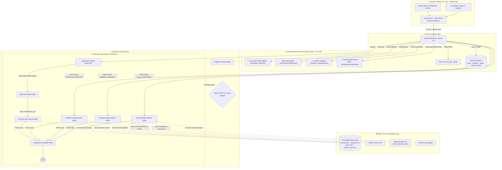
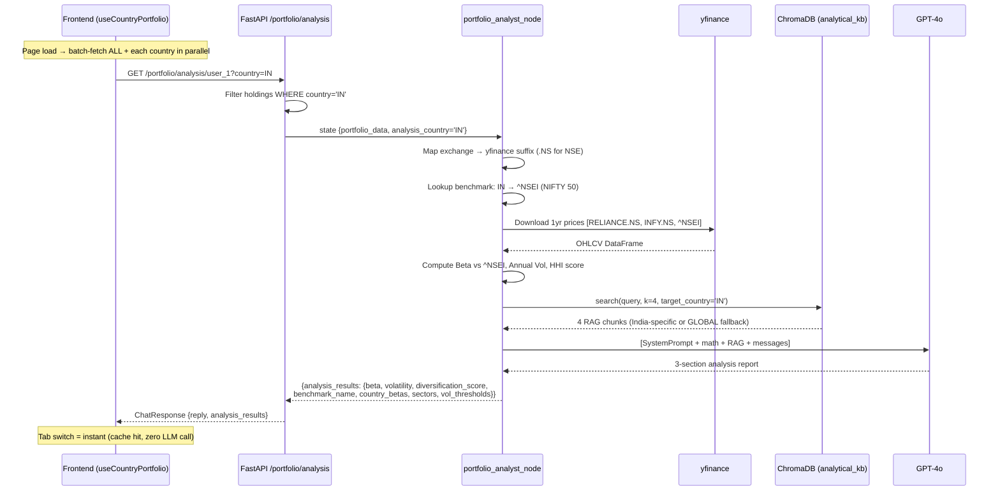

# finnie-ai: Architectural Design & System Depth

> **Last Updated:** September 2026 · v0.4.0

---

## 1. Multi-Agent Orchestration (LangGraph)

Finnie utilises a **Stateful Supervisor** pattern. The `FinnieState` TypedDict is the shared memory passed between every node in the graph.

### 1.1 The Graph State

```python
class FinnieState(TypedDict):
    messages:         Annotated[list[AnyMessage], add_messages]
    portfolio_data:   Optional[list[dict]]    # [{ticker, shares, exchange, country}]
    analysis_results: Optional[dict]          # {beta, volatility, diversification_score,
                                              #  country, benchmark_name, country_betas, …}
    market_context:   Optional[dict]
    goal_configuration: Optional[dict]        # {target_amount, target_year, country, …}
    next_step:        Optional[str]
    trace_id:         Optional[str]
    analysis_country: Optional[str]           # "US" | "IN" | "ALL" — country scope for Analyst
    user_id:          Optional[str]           # UUID string of authenticated active user
```

### 1.2 Agent Specialisation & Functionality Model

| Functionality / Agent | Execution Mode | Agent Model | Tool Calls | Responsibility |
|---|---|---|---|---|
| **User Auth** | Programmatic | None | None | Registration, login, profile management (`bcrypt` + JWT Bearer) |
| **Global Wealth Dashboard** | Programmatic | None | yfinance | Instant SQLite aggregation + live asset prices |
| **Portfolio Holdings** | Programmatic | None | None | User-isolated CRUD database operations |
| **Diversification Score Retry** | Programmatic | None | yfinance (3 retries) | Sector HHI calculation with 3-attempt exponential backoff retry loop |
| **Supervisor Agent** | AI Agentic | Multi-Agent Router | None | Decomposes query intent, routes to workers via `RouterChoice` |
| **Financial Q&A Worker** | AI Agentic | Single Agent Node | ChromaDB RAG | Semantic retrieval from `financial_kb` ChromaDB collection |
| **Market Insights Worker** | AI Agentic | Single Agent Node | Alpha Vantage API | Alpha Vantage news/sentiment + 30-min SQLite cache + LLM synthesis |
| **Portfolio Analyst Worker** | AI Agentic | Multi-Agent (Country) | yfinance + ChromaDB RAG | Country-aware Beta/Vol/HHI math + `analytical_kb` RAG + LLM report |
| **Goal Strategist Worker** | AI Agentic | Single Agent Node | Monte Carlo + ChromaDB RAG | 10,000 scenario simulation + `goal_rules` tax RAG + GPT-4o report |
| **Compliance Guardian** | Post-processor | Safety Node | None | Appends `$NFA` disclaimer to every agent output before `END` |

---

## 2. High-Level Architecture Diagram



---

## 3. Portfolio Analyst — Country-Aware Flow (Sep 2026)



---

## 4. Country → Benchmark Routing

| Country Code | Benchmark Ticker | Benchmark Name | Vol Thresholds |
|---|---|---|---|
| US | `^GSPC` | S&P 500 | low < 15%, high > 25% |
| IN | `^NSEI` | NIFTY 50 | low < 20%, high > 35% |
| GB | `^FTSE` | FTSE 100 | low < 15%, high > 28% |
| CA | `^GSPTSE` | S&P/TSX | low < 15%, high > 25% |
| DE | `^GDAXI` | DAX | low < 15%, high > 28% |
| _fallback_ | `^GSPC` | S&P 500 | 15 / 25 |

---

## 5. Technical Stack

| Layer | Technology |
|---|---|
| **Backend runtime** | Python 3.13, uv, FastAPI, Uvicorn/Gunicorn |
| **Agent orchestration** | LangGraph (stateful graph), LangChain |
| **LLM** | OpenAI GPT-4o (vendor-agnostic via `init_chat_model`) |
| **Embeddings** | Factory pattern: OpenAI / Azure OpenAI / HuggingFace |
| **Vector store** | ChromaDB — on-disk local dev, Chroma Cloud in production |
| **Primary database** | SQLite (holdings, goals, market cache) via SQLAlchemy ORM |
| **Live market data** | yfinance (prices), Alpha Vantage (news/sentiment) |
| **Frontend** | React 18, TypeScript, Vite, Vanilla CSS |
| **Observability** | LangSmith traces, custom `TraceContextMiddleware` |
| **Containerisation** | Docker (uv slim image), Gunicorn multi-worker |
| **Cloud target** | Azure App Service (backend), Azure Static Web Apps (frontend) |

---

## 6. UX/UI: The "Glass-Finance" Philosophy

- **Aesthetics**: Dark Navy/Carbon (`#0a0b10`), translucent glass cards (Glassmorphism), `cyan-400` primary accent
- **Navigation**: Persistent left sidebar (Dashboard, My Holdings, Portfolio Analyst, Market Insights, Goal Planner, Chat)
- **Portfolio Analyst**: Country tab bar — `🌍 All Markets`, `🇺🇸 US`, `🇮🇳 India` etc. Batch-loaded on mount, tab switch is always instant
- **Insight Cards**: LLM output parsed into 3 labelled section cards (📈 Risk, 🎯 Diversification, 💡 Advice) with coloured left borders — no raw markdown
- **Feedback**: Skeleton shimmer loaders, agent "thinking" indicators, pulse animations on risk-tier badges
