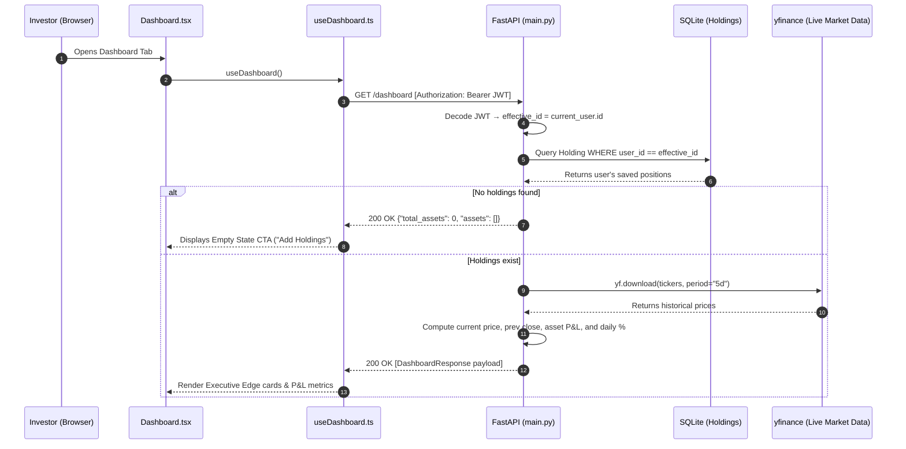
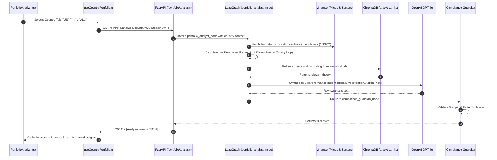
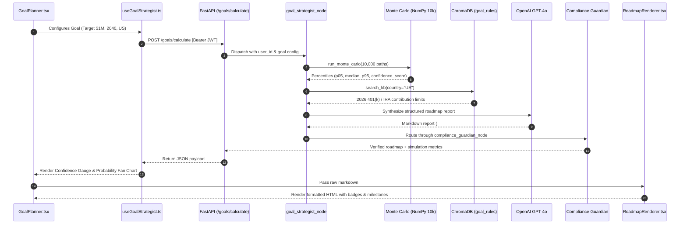
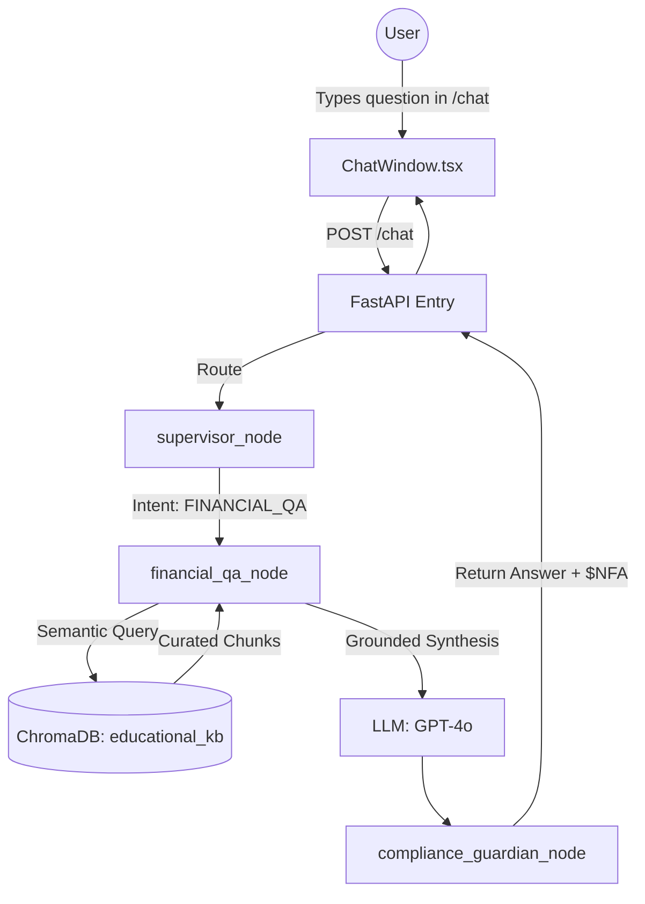

# Finnie AI — Features & Agent Intelligence Guide

This document is the authoritative technical and functional specification for all 5 core features and intelligent agent nodes in **Finnie AI**.

---

## Overview of Features

```text
┌─────────────────────────────────────────────────────────────────────────────┐
│                             FINNIE AI PLATFORM                              │
├──────────────────────────┬──────────────────────────┬───────────────────────┤
│ 1. Executive Dashboard   │ 2. Portfolio Analyst     │ 3. Market Insights    │
│ (Speed & Asset Health)   │ (Country-Aware Risk/HHI) │ (Real-Time Sentiment) │
├──────────────────────────┴──────────────────────────┴───────────────────────┤
│ 4. Goal Strategist (Monte Carlo + Tax RAG)                                  │
├─────────────────────────────────────────────────────────────────────────────┤
│ 5. Financial Q&A Worker (Grounded Education)                                │
└─────────────────────────────────────────────────────────────────────────────┘
```

---

# Feature 1: Global Wealth Executive Dashboard

## 1. 🎯 Business Context & Domain Rules
- **Problem Solved**: Beginner and intermediate investors hold assets across domestic and international accounts (e.g. US stocks and Indian equities). They lack a single, high-speed unified view of their holdings and daily net worth fluctuations.
- **Business Rule**: The Dashboard is strictly **programmatic and deterministic** (zero LLM latency). It reads directly from SQLite and fetches live closing prices via Yahoo Finance (`yfinance`) without passing through the AI reasoning graph.
- **Tenant Isolation**: Only the authenticated user's saved holdings are displayed.
- **User Experience**: Immediate render with asset P&L cards, daily change percentages, and currency groupings.

## 2. 🏗️ Diagrammatic Architectural Representation



## 3. ⚙️ Detailed Technical Implementation
- **Endpoint**: `GET /dashboard`
- **Security**: Requires `Authorization: Bearer <token>`
- **Schemas**:
  ```python
  class AssetRow(BaseModel):
      ticker: str
      shares: float
      current_price: float
      prev_close: float
      asset_pnl: float
      asset_pnl_percent: float
      total_value: float

  class DashboardResponse(BaseModel):
      total_assets: int
      assets: List[AssetRow]
  ```
- **Caching**: Client-side state managed in `useDashboard.ts`.

## 4. 🛡️ Resilience, Edge Cases & Verification
- **Missing / Delisted Ticker**: If `yfinance` returns no price for a ticker, fallback cleanly to `0.0` rather than raising a 500 error.
- **Zero Holdings**: Renders an informative empty state with an illustrative icon and CTA directing the user to the "My Holdings" tab.

---

# Feature 2: Multi-Market Portfolio Analyst

## 1. 🎯 Business Context & Domain Rules
- **Problem Solved**: Investors need institutional-grade portfolio diagnostics (Market Beta, Annualized Volatility, Sector Diversification) tailored to their local geographic markets without paying high advisor fees.
- **Domain & Compliance Rules**:
  - Must map assets to the correct local market benchmark (`^GSPC` for US, `^NSEI` for India, `^FTSE` for UK, `^GSPTSE` for Canada, `^GDAXI` for Germany, and `^GSPC` for `ALL`).
  - **Mandatory Compliance**: Every response must be processed through the Compliance Guardian to append the `$NFA` disclaimer.
  - **Diversification Scoring**: Computed using the **Herfindahl-Hirschman Index (HHI)** on sector concentration:
    $$HHI = \sum (\text{sector\_weight})^2 \quad \implies \quad \text{Score} = 10 \times \left(1 - \frac{HHI - HHI_{min}}{1 - HHI_{min}}\right)$$

## 2. 🏗️ Diagrammatic Architectural Representation



## 3. ⚙️ Detailed Technical Implementation
- **Endpoints**:
  - `GET /portfolio/analysis?country={country}`: Full risk metrics + 3-card AI insights.
  - `GET /portfolio/diversification?country={country}`: High-speed on-demand sector HHI calculation.
- **Defensive Math Guard**:
  - `valid_symbols`: Both Beta and Volatility arrays are constructed strictly from symbols that exist in **both** price return and volatility dictionaries. Mismatched symbols are excluded cleanly.
- **Scraper Retry Engine**:
  - `compute_hhi_diversification()` executes a 3-attempt exponential backoff retry loop for sector metadata lookups (`yf.Ticker().info`).
  - On retry exhaustion, returns `diversification_score = null`, triggering the interactive `"📊 Get Diversification Score"` button in the UI.

## 4. 🛡️ Resilience, Edge Cases & Verification
- **Offline Test**: `test_compute_hhi_multi_sector` in `backend/tests/test_unit.py` verifies mathematical correctness using mocked ticker info.
- **Client Caching**: `useCountryPortfolio.ts` caches tab analysis in memory, preventing duplicate LLM calls when alternating between country tabs.

---

# Feature 3: Market Insights Agent

## 1. 🎯 Business Context & Domain Rules
- **Problem Solved**: Retail investors are bombarded with raw market noise. This agent delivers a localized "morning pulse" summarizing real-time headlines and AI sentiment for their specific holdings.
- **Domain Rules**:
  - Tickers are converted to local exchange suffixes (e.g. `RELIANCE` -> `RELIANCE.NS`).
  - Translates raw news sentiment into intuitive signals: 📈 **Bullish**, 📉 **Bearish**, or ➡️ **Neutral**.
  - **Credit Protection**: Uses a 30-minute persistent SQLite cache to prevent exceeding Alpha Vantage API rate limits.

## 2. 🏗️ Diagrammatic Architectural Representation

```mermaid
graph TD
    User((User)) -->|Clicks Market Insights| UI[MarketInsights.tsx]
    UI -->|GET /market/news| API[FastAPI Entry]
    
    subgraph "Backend Engine"
        API -->|Invoke| Node[market_insights_node]
        Node -->|Check Key: NEWS:TICKERS| Cache[(SQLite: market_cache)]
        Cache -->|If Valid (<30m)| Node
        Cache -->|If Expired or Miss| AV[Alpha Vantage NEWS_SENTIMENT]
        AV -->|Raw Articles & Sentiment| Node
        Node -->|Save to Cache| Cache
        Node -->|Summarize Pulse| LLM[LLM: GPT-4o]
        Node --> Comp[compliance_guardian_node]
    end

    Comp -->|Attach $NFA| API
    API -->|Market Pulse JSON| UI
```

## 3. ⚙️ Detailed Technical Implementation
- **Endpoint**: `GET /market/news`
- **Cache Entity (`MarketCache`)**:
  - Key: `NEWS:<TICKERS_JOINED>`
  - Timezone-Aware Expiration: `is_expired(ttl_minutes=30)` safely normalizes UTC timestamps.
- **Node Contract**: Synchronous `def market_insights_node(state: FinnieState) -> dict`.

## 4. 🛡️ Resilience, Edge Cases & Verification
- **API Failure Fallback**: If Alpha Vantage is rate-limited or fails, the agent gracefully returns a portfolio-level status report based on cached or fallback sentiment without raising a 500 error.

---

# Feature 4: Goal Strategist (Financial GPS)

## 1. 🎯 Business Context & Domain Rules
- **Problem Solved**: Life goals (e.g., retirement, buying a home) require understanding long-term probabilities, not deterministic linear projections.
- **Domain & Regulatory Rules**:
  - **Monte Carlo Engine**: Runs **10,000 geometric Brownian motion scenarios** based on real portfolio risk (Beta & Volatility).
  - **Statute-Based RAG Grounding**: Must cross-reference projections against official tax contribution limits from the `goal_rules` ChromaDB collection (e.g. 2026 US IRS 401(k) / IRA limits, or India Section 80C limits).
  - **Structured UI Output**: Rendered with structured headers, glowing status badges (`● ON TRACK`, `▲ CAUTION`, `■ AT RISK`), milestones, and compliance callouts.

## 2. 🏗️ Diagrammatic Architectural Representation



## 3. ⚙️ Detailed Technical Implementation
- **Endpoints**:
  - `GET /goals`: Fetches user's saved primary goal.
  - `POST /goals/calculate`: Executes 10,000 Monte Carlo runs and synthesizes roadmap.
- **Presentation Component**:
  - [`RoadmapRenderer.tsx`](file:///Users/prajosh/Development/finnie-ai/frontend/src/components/Goals/RoadmapRenderer.tsx): Zero-dependency custom markdown parser matching status chips (`.status-on-track`, `.status-caution`, `.status-at-risk`), headers, bullet points, and `$NFA` disclaimer callouts.

## 4. 🛡️ Resilience, Edge Cases & Verification
- **Percentile Invariant**: Automated test `test_monte_carlo_positive_horizon` in `backend/tests/test_unit.py` verifies that $P_{05} \le \text{Median} \le P_{95}$.
- **Zero Horizon Handling**: Safely flags immediate goals (years = 0) with `confidence_score = 0`.

---

# Feature 5: Financial Q&A Worker

## 1. 🎯 Business Context & Domain Rules
- **Problem Solved**: Beginner investors have basic and intermediate questions (e.g. *"What is an ETF?"*, *"How does compound interest work?"*).
- **Domain Rules**: Answers must be grounded in curated educational materials (Investor.gov, SEC, Vanguard textbooks) to prevent LLM hallucinations.
- **Compliance**: Concludes with mandatory `$NFA` disclaimer.

## 2. 🏗️ Diagrammatic Architectural Representation



## 3. ⚙️ Detailed Technical Implementation
- **Endpoint**: `POST /chat`
- **Schema**: `ChatRequest(message=str, portfolio_context=...)` ➔ `ChatResponse(reply=str, trace_id=...)`.
- **Retrieval**: Uses `VectorStoreManager` with semantic similarity search (`k=3`).

## 4. 🛡️ Resilience, Edge Cases & Verification
- **Vector DB Disconnection**: If ChromaDB is unavailable, falls back gracefully to standard LLM general knowledge while logging a diagnostic warning.
