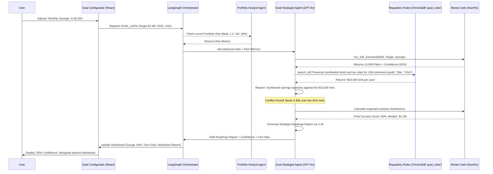

# Goal Strategist: The "Financial GPS" Technical Design

> **Status:** ✅ Implemented | **Target:** Phase 4 (Goal Strategist)

Finnie’s **Goal Strategist** is a multi-agent feature that translates life goals into a mathematically-validated and legally-accurate investment roadmap. It is **Portfolio-Aware** (uses your real risk) and **Country-Aware** (uses your real tax rules).

---

## 🎨 1. User Experience Flow: "Configurator to Roadmap"

Instead of a generic chat, the Goal Planner uses a **"Progressive Disclosure"** UI:

1.  **Stage 1: Input Form** (Goal, Target $, Year, Country, Monthly Savings).
2.  **Stage 2: Graph Execution** (Simulation + LLM-Driven RAG Validation).
3.  **Stage 3: Strategic Dashboard** (Confidence Gauge, Fan Chart, Milestone Timeline).
4.  **Stage 4: AI Synthesis** (Personalized expert advice generated by GPT-4o based on Monte Carlo and Local Tax Rules).

---

## 🏗️ 2. System Orchestration

The following diagram illustrates how the frontend coordinates with the multi-agent graph to generate the goal roadmap.

---

## ⚙️ 3. Core Technical Components

### 3.1 The Monte Carlo Engine (`backend/src/utils/simulations.py`)
A fast, vectorized Python engine using `numpy` to generate realistic market paths.
- **Drift**: Expected market return (from Analyst data).
- **Diffusion**: Market volatility (Standard Deviation).
- **Calculation**: geometric Brownian Motion (GBM) to simulate the portfolio value over $N$ months.
- **Output**: An array of 10,000 final values used to build the **Fan Chart**.

### 3.2 The Tax Validator & Synthesizer (`backend/src/agents/goal_strategist.py`)
A LangGraph node that uses the user's `country` selection to query the local ChromaDB `goal_rules` collection.
- **Knowledge Base**: `content/regulatory_kb/` (e.g., `US_Retirement_Rules_2026.md`, `India_Tax_Rules_2026.md`).
- **Validation**: Re-formats search queries based on target_country metadata to ensure country-specific laws are pulled.
- **Synthesis:** An LLM (`init_chat_model`) combines the math array (from NumPy) and legal array (from RAG) into a user-friendly conversational roadmap.

### 3.3 Persistence Layer (`src/models/goal.py`)
A SQLite table to store Sarah's Goals:
- `id`: Unique goal ID.
- `user_id`: Link to the user profile.
- `goal_name`: "Dream Home", "Early Retirement".
- `target_amount`: (e.g., 1500000).
- `target_year`: (e.g., 2035).
- `monthly_contribution`: (e.g., 2000).
- `residence_country`: "USA", "IN", "UK".
- `account_baskets`: (JSON string: `{"401k": 60, "Roth": 40}`).

---

## 🏁 4. Definition of Done (DoD)

- [x] **Data Pipeline**: Goal inputs are correctly passed from UI to the `FinnieState`.
- [x] **Math Engine**: Monte Carlo returns a consistent confidence score vs standard financial models.
- [x] **RAG Grounding**: The agent identifies and flags country-specific contribution limits using ChromaDB `goal_rules`.
- [x] **UI Visualization**: The gauge and fan chart update seamlessly to display simulation distributions.
- [x] **Strategic Synthesis**: The AI successfully blends math constraints and RAG laws to produce an actionable roadmap string.
