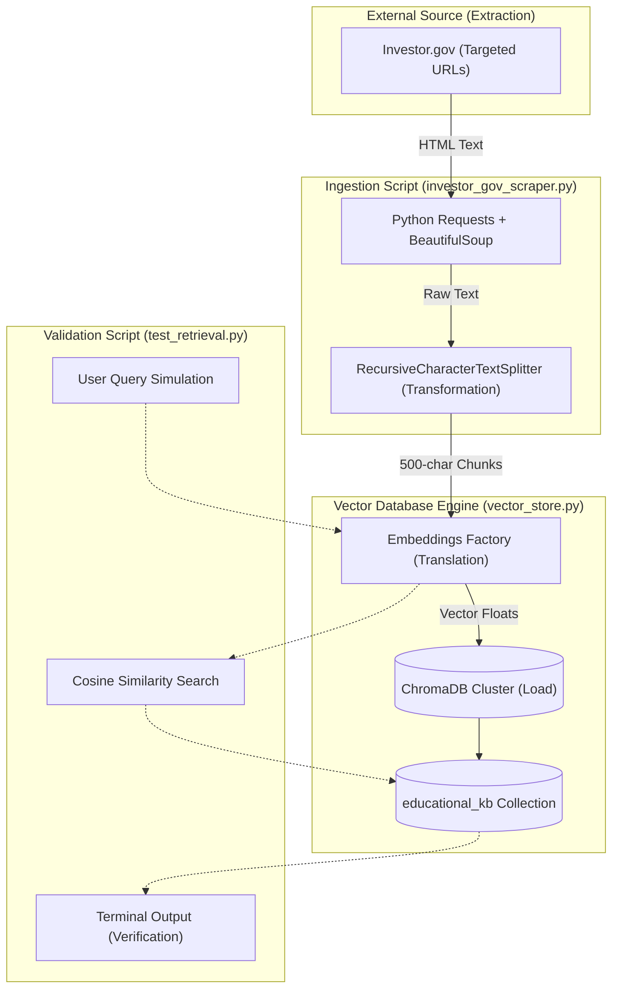

# Finnie AI: Data Ingestion Pipelines
**Developer Technical Guide & Architecture**

This guide provides a comprehensive, step-by-step technical walkthrough of the various data ingestion pipelines that power Finnie AI's intelligence. It is designed to help new developers understand how the foundational knowledge bases are collected, processed, and validated.

---

## Pipeline 1: Educational Knowledge Base (`educational_kb`)
**Target:** Investor.gov Glossary (Phase 1)
**Usage:** Provides definitive, beginner-friendly financial definitions for the Financial Q&A Agent.

### 🏗️ Architecture & Component Flow

The ingestion pipeline follows an **Extract, Transform, Load (ETL)** pattern, tailored for AI Retrieval-Augmented Generation (RAG).



---

## 🛠️ Step-by-Step Component Breakdown

### 1. Extraction: The Scraper (`investor_gov_scraper.py`)
**Goal:** Pull targeted, highly accurate financial definitions directly from a government-regulated source (Investor.gov) rather than a commercial or Wikipedia-style site like Investopedia. This aligns with Finnie's Phase 4 Compliance Guardian requirements.

*   **Mechanism:** We use a simple web crawler constructed with the Python `requests` library and parsed using `BeautifulSoup`.
*   **Depth Strategy:** We use a strict **Depth 1 Strategy**. We define a dictionary of exact term slugs (e.g., `"mutual-funds"`) and fetch only the body text of those exact definition pages. The script explicitly ignores child links to avoid polluting the database with irrelevant tangental context (context bloat).
*   **Internationalization (i18n) Strategy:** Metadata Filtering. Every scraped document is hard-tagged with `{"country": "USA"}` before embedding.
    *   *Pros:* Allows a single, unified database to serve global users. The LangGraph agent simply appends a `$filter` to its search query based on the user's origin, preventing USA tax rules from being served to UK users. Massively reduces vector store maintenance.
    *   *Cons:* Requires strict discipline during ingestion; if a developer forgets to tag a document, it becomes "global" and could leak across borders.

### 2. Transformation: The Splitter
**Goal:** Language Models perform best when given small, dense pockets of information to reason over, rather than entire web pages.

*   **Mechanism:** The raw scraped text strings are passed through LangChain's `RecursiveCharacterTextSplitter`.
*   **Configuration:** The text is partitioned into strict "Chunks." We use a conservative `chunk_size` of 500 characters, with an overlap of 50 characters between chunks to prevent sentences from being violently cut in half.

### 3. Translation & Load: The Vector Store Manager (`vector_store.py`)
**Goal:** Convert human language into mathematical arrays (vectors) that a computer can rapidly compare for "similarity."

*   **Embeddings Factory Engine**: The script takes the 500-character string chunks and passes them through an **Embeddings Factory**.
    *   *Vendor Agnosticism:* The `VectorStoreManager` calls `get_embeddings()`, which reads the `EMBEDDING_PROVIDER` env var. This allows switching between OpenAI, Azure OpenAI, or Hugging Face without a single line of code change.
    *   *Development Note:* If `OPENAI_API_KEY` is missing or set to `"dummy_key_for_testing"`, the system natively falls back to `FakeEmbeddings` to allow free development.
*   **Storage Framework:** Data is persisted via **ChromaDB**. The system supports a **Hybrid Storage Mode**:
    *   **Local Mode:** If `CHROMA_API_KEY` is empty, data is saved to `backend/src/chroma_db`.
    *   **Cloud Mode:** If `CHROMA_API_KEY` is provided, the system connects directly to Chroma Cloud (e.g., `finnie-ai-db`).
*   **Update Strategy:** Drop-and-Replace. Before insertion, the script executes `db.delete_collection()`.
    *   *Storage Optimization:* In local mode, the pipeline performs a **physical directory cleanup** (`shutil.rmtree`) before initialization to prevent the accumulation of orphaned UUID subdirectories.

### 4. Verification: The Retrieval Test (`test_retrieval.py`)
**Goal:** Prove that the Chunking limits and the Embedded Math actually work *before* wiring up an expensive LLM.

*   **Mechanism:** This interactive CLI script takes a human query via the terminal (e.g., `"What is an ETF?"`), vectorizes the question using the precise exact same model used for ingestion, and asks ChromaDB to return the top `k=3` most mathematically similar chunks.
*   **Result:** A human developer reads the terminal output to manually audit the "Context Precision" of the Database. If the returned chunks accurately answer the question, the pipeline is viable!

---

## 🚀 Local Setup & Execution Instructions

If you are a new developer setting up this environment for the first time, run the following commands sequentially to build the vector database on your local machine.

### Prerequisites
Make sure you have `uv` installed via Homebrew (`brew install uv`) and you are navigating to the `/backend` directory of the project in your terminal.

```bash
# 1. Navigate to the backend directory
cd /Users/<your_username>/Development/finnie-ai/backend

# 2. Setup your Environment Variables
cp .env.example .env
# Open .env and insert your real OPENAI_API_KEY (or leave as dummy_key_for_testing)

# 3. Sync dependencies (uv handles the virtual environment automatically!)
uv sync
```

### Running the Pipeline

### Running the Pipeline

**Step 1: Execute the Ingestion (Scraping) Script**
We need to populate the database with definitions. First run will scrape Investor.gov, chunk the text, apply the USA country tag, and load it into ChromaDB.

```bash
# Auto-detect (Cloud if API key present, else Local)
uv run scripts/ingest/investor_gov_scraper.py

# Force specific mode via CLI flag
uv run scripts/ingest/investor_gov_scraper.py --db local
uv run scripts/ingest/investor_gov_scraper.py --db cloud
```

**Step 2: Execute the Retrieval Validation Test**
Now, verify the system can look up facts using metadata filtering.

```bash
# General usage
uv run scripts/test_retrieval.py "How does an Index Fund work?" USA

# Force specific mode
uv run scripts/test_retrieval.py "What is an ETF?" USA --db cloud
```
*Expected Output:* The terminal will print out the top 3 chunks retrieved from the database. Read the text to verify they accurately explain the term.

---

## Pipeline 2: Analytical Knowledge Base (`analytical_kb`)
**Target:** Local Investopedia HTML snippets (Phase 3)
**Usage:** Provides theoretical grounding (Sharpe Ratio, Beta, Volatility benchmarks) for the Portfolio Analyst Agent.

### 🏗️ Component Breakdown

#### 1. Extraction: Local HTML Loader (`load_html_analytical_kb.py`)
**Goal:** Ingest complex financial theory that requires manual curation or specific versions of definitions (e.g., MPT, Efficient Frontier).

*   **Mechanism**: Instead of live scraping, this pipeline reads pre-downloaded HTML files from `backend/scripts/ingest/content/analtical_kb/`.
*   **Parsing**: Uses BeautifulSoup with the `.article-body-content p` selector discovered during the Investopedia audit.
*   **Metadata**: Automatically tags every chunk with:
    *   `topic`: Derived from the filename (e.g., "Sharpe Ratio").
    *   `category`: `metric_benchmark` or `theory`.
    *   `country`: `GLOBAL` (unless in a subfolder like `/US/`).

#### 2. Load: ChromaDB Integration
*   **Collection**: `analytical_kb`.
*   **Update Strategy**: Supports `--reset` flag to clear the collection before loading fresh theory.

### 🚀 Running the Pipeline

```bash
cd backend

# Load local HTML files into ChromaDB
uv run scripts/ingest/load_html_analytical_kb.py --reset

# Verify retrieval of theory
uv run scripts/test_retrieval.py "What is a good Sharpe Ratio?" analytical_kb
```
