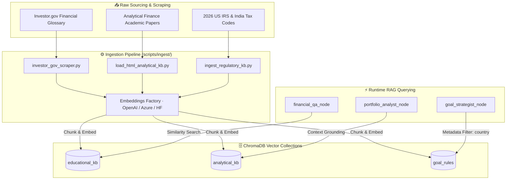

# Finnie AI — Knowledge Base & RAG Architecture Guide

This document specifies the vector storage architecture, data ingestion pipelines, and retrieval-augmented generation (RAG) strategies used in **Finnie AI**.

---

## 1. 🎯 Business Context & Domain Rules

- **Why RAG?**: LLMs produce generic or outdated financial answers and frequently hallucinate statutory contribution limits and regulatory definitions.
- **Domain Rules**:
  - **Factual Grounding**: Answers to educational and tax questions MUST cite curated documents scraped from Investor.gov, SEC, and official tax codes.
  - **Geographic Filtering**: Tax rules must filter on metadata matching the user's residence (e.g. `country="US"` for 401(k) / Roth IRA limits, `country="IN"` for Section 80C).
  - **Embeddings Portability**: Must support switching between OpenAI, Azure OpenAI, and local HuggingFace embeddings with zero code changes.

---

## 2. 🏗️ Diagrammatic Architectural Representation



---

## 3. ⚙️ Detailed Technical Implementation

### A. Vector Store Taxonomy ("One DB, Three Active Collections")

| Collection Name | Content Type | Primary Consumers | Metadata Filtering |
|---|---|---|---|
| **`educational_kb`** | Core definitions (stocks, bonds, ETFs, compound interest) | `financial_qa_node` | None |
| **`analytical_kb`** | Theoretical finance principles (Sharpe, Beta, HHI) | `portfolio_analyst_node` | None |
| **`goal_rules`** | 2026 Statutory tax limits & contribution ceilings | `goal_strategist_node` | `{"country": "US"}` or `{"country": "IN"}` |

### B. The Embeddings Factory (`backend/src/utils/embeddings_factory.py`)
Driven by environment variables for vendor agility:
- `EMBEDDING_PROVIDER="openai"` ➔ `text-embedding-3-small`
- `EMBEDDING_PROVIDER="azure"` ➔ Azure OpenAI Embeddings deployment
- `EMBEDDING_PROVIDER="huggingface"` ➔ Local CPU/GPU sentence transformers

### C. Ingestion CLI Commands
```bash
cd backend

# Local SQLite Chroma (Development)
uv run python scripts/ingest/investor_gov_scraper.py --db local --reset
uv run python scripts/ingest/load_html_analytical_kb.py --db local --reset
uv run python scripts/ingest/ingest_regulatory_kb.py --db local --reset

# Chroma Cloud (Production)
uv run python scripts/ingest/investor_gov_scraper.py --db cloud --reset
uv run python scripts/ingest/load_html_analytical_kb.py --db cloud --reset
uv run python scripts/ingest/ingest_regulatory_kb.py --db cloud --reset
```

---

## 4. 🛡️ Resilience, Edge Cases & Verification

- **Idempotent Ingestion**: Scripts support the `--reset` flag to purge and rebuild collections without duplicating chunks.
- **Offline / Missing Database Fallback**: If ChromaDB is unavailable or collections are empty, agent nodes log a diagnostic warning and proceed with standard general knowledge without raising 500 errors.
