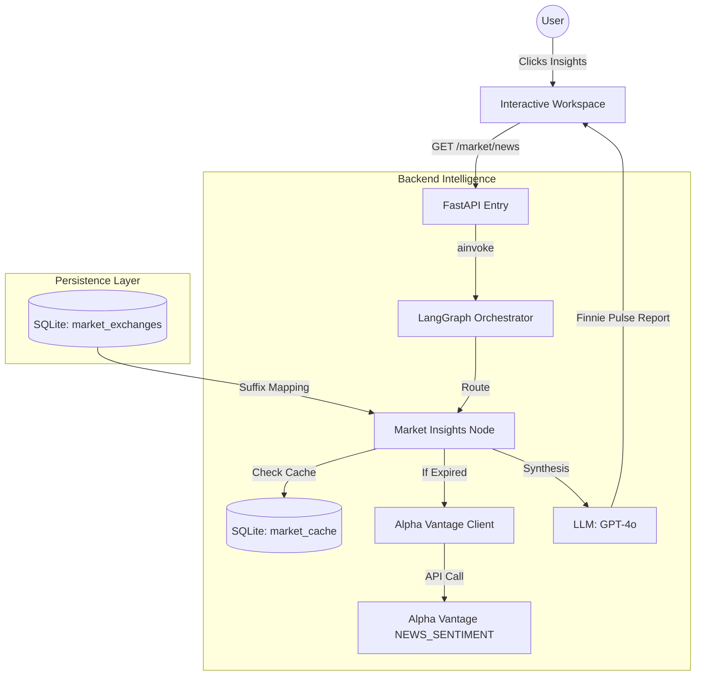

# Market Insights Agent — End-to-End Guide

> **Status:** ✅ Fully Implemented (Backend + Frontend) | Live API + 30m Cache | Workspace UI 2.0

---

## What Does This Agent Do?

The **Market Insights Agent** is Finnie's real-time "newsroom." It tracks global stock markets, fetches the latest headlines, and uses AI to determine market sentiment for a user's specific portfolio.

| Capability | Experience |
|---|---|
| **Portfolio Pulse** | A localized "morning report" summarizing news for all your holdings (grouped by country). |
| **Ticker Deep-Dive** | Real-time sentiment analysis for any specific ticker (e.g., "$NVDA" or "Reliance Industries"). |
| **Global Support** | Context-aware news fetching for US (NYSE/NASDAQ), India (NSE/BSE), UK (LSE), and Canada (TSX). |
| **Sentiment Scoring** | Translates raw news into 📈 **Bullish**, 📉 **Bearish**, or ➡️ **Neutral** signals. |

---

## Architecture Overview



---

## Key Technical Components

### 1. Global Market Master (Metadata)
To support international stocks, we use a master metadata table `market_exchanges`. This allows Finnie to map a human-readable exchange (like "NSE") to an API-specific suffix (like ".NS" for yfinance or ".NSE" for Alpha Vantage).

**Example Mapping**:
- `RELIANCE` + `NSE` → `RELIANCE.NS`
- `AAPL` + `NASDAQ` → `AAPL`

### 2. Workspace UI 2.0 (Toggleable Assistant)
The "Market Insights" and "Portfolio Analyst" tabs feature a modernized, content-first layout:
- **Immersive Default View**: Analysis reports now expand to **100% full-width** for maximum readability, solving "stuck" or "static" window issues.
- **On-Demand Assistant**: A glowing **"🧠 Ask Finnie"** button in the header toggles the interactive sidebar only when you have follow-up questions.
- **High-Visibility Scrollbars**: Upgraded 8px scrollbars with a translucent track to ensure navigation is always intuitive.

### 3. Alpha Vantage Client (`src/utils/alpha_vantage.py`)
A robust asynchronous client that handles:
- **Rate Limit Detection**: Gracefully recognizes "Note" messages from free-tier keys.
- **Multi-Ticker Queries**: Batches requests to minimize network overhead.
- **Sentiment Normalization**: Extracts `ticker_sentiment_label` for LLM grounding.

### 4. 30-Minute Persistence Cache (`src/models/market_cache.py`)
To protect the user's API limits (especially on the free tier), every successful news fetch is cached in SQLite.
- **TTL**: 30 minutes (customizable in `market_insights.py`).
- **Logic**: Finnie only goes to the "Live Wire" if the local data is stale or missing.

---

## Data Flow: "The News Pulse"

1.  **Intent Discovery**: The Supervisor agent identifies news/sentiment intent (e.g., *"What's happening in the market?"*).
2.  **Ticker Extraction**: The Insights node pulls the user's holdings from the `portfolio_data` state variable.
3.  **Cache/Fetch**: The node checks the `market_cache` table. If a refresh is needed, it calls Alpha Vantage.
4.  **LLM Synthesis**: Raw JSON news (headlines + sentiment scores) is passed to the LLM with a specialized "Financial Journalist" system prompt.
5.  **Grounded Report**: Finnie generates a 2-3 paragraph summary grouped by sector or country with emoji indicators.

---

## Configuration & Setup

### Environment Variables
Required in your `.env` file:
```env
ALPHA_VANTAGE_API_KEY=your_key_here
LLM_PROVIDER=openai
LLM_MODEL=gpt-4o
```

### Seeding Metadata
The world exchange master data must be seeded once to enable the UI dropdowns:
```bash
cd backend
PYTHONPATH=. uv run scripts/seed_exchanges.py
```

---

## Files Reference

| File | Purpose |
|---|---|
| `backend/src/agents/market_insights.py` | The LangGraph node logic + cache TTL management. |
| `backend/src/utils/alpha_vantage.py` | Async API client for News & Sentiment. |
| `backend/src/models/market_cache.py` | SQLAlchemy model for SQLite caching. |
| `backend/src/models/market_metadata.py` | Global exchange master data model. |
| `frontend/src/components/Market/MarketInsights.tsx` | Split-view workspace UI. |
| `frontend/src/hooks/useMarketInsights.ts` | Frontend data fetching hook. |

---

## 🏁 Implementation Checklist

- [x] **Phase 1: Metadata Master** — Created `market_exchanges` and seed script.
- [x] **Phase 2: Live Client** — Implemented `AlphaVantageClient` with error handling.
- [x] **Phase 3: Persistence** — Built 30-min SQLite cache for API optimization.
- [x] **Phase 4: Async Graph** — Converted `main.py` and graph nodes to `async` for real-time fetching.
- [x] **Phase 5: Interactive UI (Beta)** — Implemented the initial 2-column workspace.
- [x] **Phase 6: Observability** — Added `[FINNIE-AI]` prefixed logs for terminal transparency.
- [x] **Phase 7: Workspace UI 2.0** — Implemented the final toggleable header assistant, full-width reports, and scrollbar polish.
