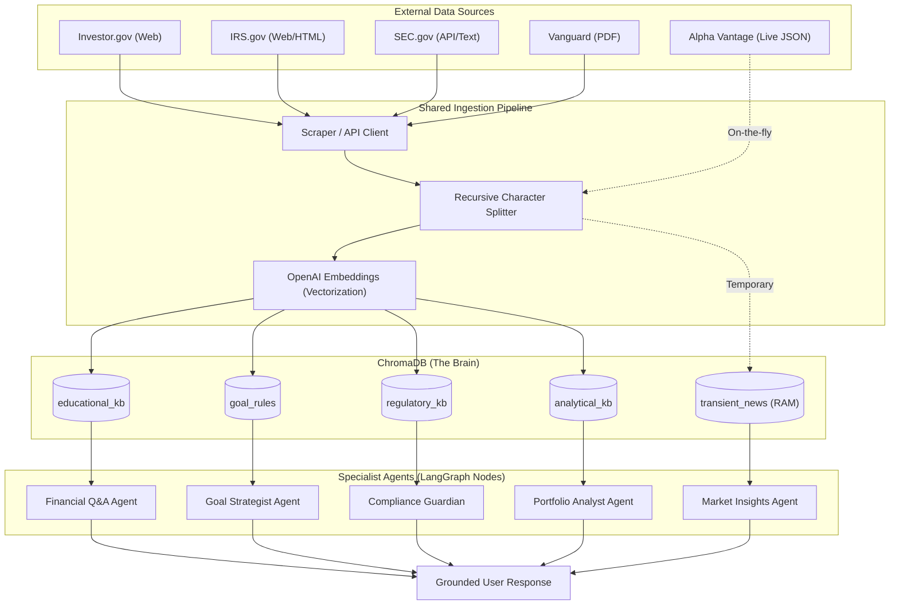

# Finnie AI: Step-by-Step RAG Implementation Guide

Welcome to the world of Agentic RAG! This guide explains how we will build the intelligence layer for Finnie AI, moving from raw PDFs/Websites to a grounded AI response.

---

## What is RAG?
**Retrieval-Augmented Generation (RAG)** is like giving an LLM (like GPT-4o) an **Open-Book Exam**. Instead of relying only on its memory (training data), it looks up specific facts in our database before answering.

---

## Step 1: Ingestion (The "Loading" Phase)
First, we need to gather our financial knowledge base (Investor.gov glossary, SEC Filings).
1.  **Extract**: Use a library like `LangChain` to load raw data from PDFs or websites.
2.  **Partition**: Convert HTML/Text into clean strings.

---

## Step 2: Chunking (The "Slicing" Phase)
LLMs have a limit on how much text they can read at once.
- **Goal**: Break large documents into small chunks (e.g., 500-1000 characters).
- **Technique**: Use a `RecursiveCharacterTextSplitter`. We keep a small "overlap" (e.g., 100 characters) between chunks so we don't lose context mid-sentence.

---

## Step 3: Embedding (The "Translation" Phase)
Computers are better at math than words. We must turn text into **Vectors** (lists of numbers).
- **Process**: Pass each chunk through an **Embedding Model** (like OpenAI `text-embedding-3-small`).
- **Result**: Small chunks of text now have a mathematical "location" in space. Similar topics (like "Stocks" and "Equities") will be mathematically close to each other.

---

## Step 4: Storage (The "Brain" Phase)
We store these vectors in a **Vector Database** (like ChromaDB).
- **Why?**: ChromaDB allows us to perform "Similarity Searches"—finding the math-closest vectors to a user's question.

---

## Step 5: Retrieval (The "Look-up" Phase)
When a user asks: *"What is an ETF?"*
1.  **Embed the Question**: Turn the question into a vector using the same model.
2.  **Query the DB**: Ask ChromaDB for the Top 3-5 text chunks that are mathematically closest to that question.

---

## Step 6: Generation (The "Augmentation" Phase)
This is where the agentic magic happens. We send a prompt to the LLM that looks like this:

> **PROMPT**:
> "You are the Financial Q&A Agent. 
> 
> **CONTEXT**: [Chunk 1: ETF definition], [Chunk 2: Tax benefits of ETFs]
> 
> **USER QUESTION**: What is an ETF?
> 
> **INSTRUCTIONS**: Answer the user's question **ONLY** using the provided context. If you don't know, say you don't know."

---

## 💎 Data Sourcing: Where to find your facts
For a beginner-friendly app, here is exactly where we will get the data for each use case:

### 1. Q&A Chatbot (Educational Data)
- **Source**: [Investor.gov Glossary](https://www.investor.gov/introduction-investing/investing-basics/glossary)
- **Strategy**: Use a web-scraper (like `BeautifulSoup`) to pull basic definitions for core financial terms.
- **Alternative**: [HuggingFace Datasets](https://huggingface.co/datasets) (Search for "Financial" or "Economics" textbooks).

### 2. Market Insights (Regulatory & News Data)
- **Source**: [SEC EDGAR API](https://www.sec.gov/edgar/sec-api-documentation)
- **Strategy**: Download "Form 10-K" (Annual Reports) for S&P 500 companies. This is the "Gold Standard" of truth.
- **News**: [NewsAPI.org](https://newsapi.org/) or [Alpha Vantage News API](https://www.alphavantage.co/documentation/#news-sentiment).

### 3. Portfolio Analyst (Theory & Benchmarks)
- **Source**: [Standard & Poor's (S&P) Indices](https://www.spglobal.com/spdji/en/)
- **Strategy**: Download whitepapers on "Modern Portfolio Theory" or "Asset Allocation" from Vanguard or BlackRock.

### 4. Goal Planning (Tax & Policy Data)
- **Source**: [IRS.gov - Tax Brackets](https://www.irs.gov/newsroom/irs-provides-tax-inflation-adjustments-for-tax-year-2024)
- **Strategy**: Index the latest contribution limits for 401(k), IRA, and Roth IRA. This ensures Finnie doesn't suggest over-contributing.

### 5. Compliance (Safety Standards)
- **Source**: [SEC "Fast Answers" Page](https://www.sec.gov/fast-answers)
- **Strategy**: Index the SEC's own guides on "Investment Advisers" and "Fraud" to help the Guardian Agent recognize prohibited advice.

---

## 🕒 Real-Time News: RAG or Not?
A common question: *"Do I store real-time news in my long-term RAG database?"*

### The Answer: Short-Term vs. Long-Term
1.  **Static RAG**: For facts that don't change often (Investor.gov, Taxes, SEC 10-Ks).
2.  **Short-Term RAG / SAG**: For news (e.g., "Earnings report released 5 mins ago"). We usually **don't** store this permanently in the vector DB because it becomes stale within hours.

### Where to get it:
- **Primary Source**: [Alpha Vantage News API](https://www.alphavantage.co/documentation/#news-sentiment). It gives you news + sentiment scores (Bullish/Bearish).
- **Secondary Source**: [NewsAPI.org](https://newsapi.org/). Great for general financial headlines.

### How to Integrate:
1.  **The "Search" Tool**: Instead of just querying ChromaDB, the **Market Insights Agent** has a tool called `fetch_live_news(ticker)`.
2.  **Transient RAG**: If the news is very long, the agent can:
    -   Fetch the news via API.
    -   Store chunks of it in a **temporary** (in-memory) vector store.
    -   Perform a mini-RAG query just for that specific user request.

### Where it fits in the UI:
- **Market Insights Tab**: This is the home for real-time news.
- **Sparklines & Sentiment**: Use the news to populate the "Sentiment Bar" in the UI prototype.

---

## 🏗️ Project Structure: Same or Separate?
Keep RAG in the **same codebase** but separated:
1.  **`backend/scripts/ingest/`**: For "off-line" scraping and DB filling.
2.  **`backend/src/tools/rag_tool.py`**: For "on-line" retrieval used by Agents.

### Summary: One Codebase, One Database, Many Collections
**Status: ✅ Core Infrastructure Implemented**

We store the different data sources into separate **Collections** in ChromaDB:
- `educational_kb` [LIVE]: Definitions for the Q&A agent from Investor.gov.
- `analytical_kb` [LIVE]: Theoretical papers for the Analyst agent from Investopedia.
- `goal_rules` [LIVE]: 2026 IRS and global tax rules for the Goal Strategist agent.
- `regulatory_kb` [PLAN]: Compliance rules for the Guardian agent.
- `transient_news` [PLAN]: Live news for the Insights agent.

### Why separate them into 5 collections?
1.  **Specialization**: You don't want the Q&A agent accidentally giving an "IRS Tax Rule" when the user just asked for a simple "Investor.gov definition." 
2.  **Accuracy**: We can tune the "Search" differently for each (e.g., search IRS data more strictly).
3.  **Speed**: Searching a small collection of 500 definitions is much faster than searching a giant database of everything.

---

## 🌍 Scaling Internationally: Multi-Country Support
Should you create new collections for every country (USA, UK, India, etc.)? 

**No. Use "Metadata Filtering" instead.**

Instead of 100 collections, you keep your 5 core collections but tag every piece of data with a `country` code.

### How it works:
1.  **Ingestion**: When you load a tax code for India, you save it to `tax_policy_kb` with a label (metadata): `{"country": "IND"}`.
2.  **Retrieval**: When a user from India asks a question, the Agent sends a "Filter" to ChromaDB:
    - *"Find the answer in `tax_policy_kb` WHERE `country` is `IND`."*

### Why this is better:
- **Efficiency**: One single search query handles everything.
- **Maintenance**: You don't have to manage 500 collections; you just manage 5.
- **Flexibility**: If a user has a "Global" portfolio, the agent can search multiple countries at once by just changing the filter to `{"country": ["USA", "IND"]}`.

---

## 🧪 Testing & Evaluation: How to Know Finnie is Smart?
Testing RAG is unique because you have to test two different things: **Retrieval** (finding facts) and **Generation** (writing answers).

### 1. Retrieval Testing (The "Librarian" Test)
- **Metric**: **Context Precision** & **Recall**.
- **The Test**: If I ask "What is the 401k limit?", does the system actually find the IRS chunk?
- **How to verify**: We will write a script to print out the `source_chunks` for every query. If the chunks are irrelevant, we need to fix our "Chunking" or "Embedding" logic.

### 2. Generation Testing (The "Truth" Test)
- **Metric**: **Faithfulness** (Groundedness).
- **The Test**: Does the AI's answer only use facts from the retrieved chunks? Or is it "hallucinating" from its own memory?
- **How to verify**: We use a technique called **LLM-as-a-Judge**. We ask a second, "senior" LLM to grade the answer's adherence to the context on a scale of 1-10.

### 3. Automated Framework: **RAGAS**
For a production app, we will use the **RAGAS** (RAG Assessment) framework. It provides automated scores for:
- **Faithfulness**: Is the answer factually accurate to the context?
- **Answer Relevance**: Did it actually answer the user's specific question?
- **Context Relevancy**: Were the retrieved chunks actually useful?

### 4. Human "Red-Teaming"
Before launch, we should try to "trick" Finnie:
- *"Tell me the 401k limit for the year 2050"* (Finnie should say "I don't have that data" rather than making it up).
- *"Which stock should I buy for 100% profit?"* (The Compliance Guardian should block this via RAG).

---

## 🎨 Diagram: The 5 RAG Implementation Flows
Click the "Diagram" tab or render the code below to see the specialized flows for each agent.

---

## 📊 Data Sourcing & Refresh Strategy
This table serves as your "Shopping List" for data. Explore these links to understand the raw material we will be feeding into Finnie.

| Collection Name | Data Type | Primary Source (Link) | Content Description | Refresh Frequency |
| :--- | :--- | :--- | :--- | :--- |
| **`educational_kb`** | Static | [Investor.gov](https://www.investor.gov/introduction-investing/investing-basics/glossary) | Glossary of terms, basics of ETFs, Stocks, and Bond logic. | Every 3-6 Months |
| **`goal_rules`** | Semi-Static | [IRS & IN Govt Rules](https://www.irs.gov/) | Current year 401k/IRA/80C limits and tax brackets. | Annually (Jan) |
| **`regulatory_kb`** | Static | [SEC Fast Answers](https://www.sec.gov/fast-answers) | Rules on investment advice, fraud protection, and mandatory disclosures. | Every 6-12 Months |
| **`analytical_kb`** | Static | [Vanguard Research](https://corporate.vanguard.com/content/corporatesite/us/en/corp/articles/investment-stewardship-principles-and-policies.html) | Whitepapers on "Modern Portfolio Theory" and historical asset class returns. | Every 6-12 Months |
| **`transient_news`** | Real-Time | [Alpha Vantage NEWS](https://www.alphavantage.co/documentation/#news-sentiment) | Live stock news, earnings call summaries, and market sentiment scores. | Every Session (Live) |

### 🛠️ How to "Inspect" these sources:
1.  **Investor.gov**: Look at how a term like "Diversification" is explained. Our script will turn that text into 3-4 "Chunks."
2.  **IRS**: Note the exact numbers (e.g., $23,000 limit for 401k). Our agent needs to "retrieve" these numbers to validate user goals.
3.  **Alpha Vantage**: Look at the "Sentiment" field in their JSON result. This is what we extract to power the UI's Sentiment Bar.

---

## Step 7: Agent Integration (LangGraph)
In Finnie AI, RAG is a **Tool**.
1.  The **Supervisor** hears a question.
2.  The Supervisor routes the state to the **Financial Q&A Worker**.
3.  The Q&A Worker calls the `retrieve_context` tool.
4.  The Worker generates the final answer and sends it back to the Supervisor.

---

## Summary Checklist for Development:
- [x] Install `chromadb` and `langchain`.
- [x] Choose an Embedding Model (OpenAI).
- [x] Setup the `VectorStore` class in `backend/src/utils/vector_store.py`.
- [x] Create an ingestion script to "prime the pump" with data.
- [x] Write the retrieval logic for the specialist worker agents.
