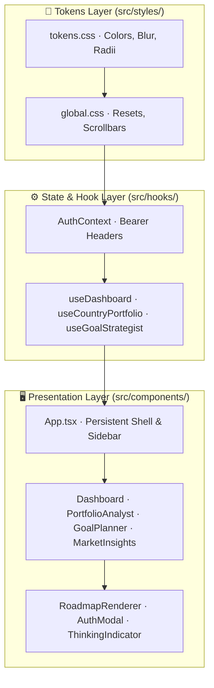

# Finnie AI — Glass-Finance UI Design System & Component Guide

This document is the visual and technical specification for Finnie AI's **Glass-Finance** design system, component lifecycle, and interactive previews.

---

## 1. 🎯 Business Context & UX Philosophy

- **Target Persona**: Beginner and intermediate investors seeking clarity, institutional trust, and modern financial guidance without overwhelming Wall Street terminal clutter.
- **Design Philosophy**:
  - **Institutional Elegance**: Deep-space dark mode with frosted glass cards (`backdrop-filter: blur(12px)`).
  - **Dynamic Visual Feedback**: Pulsing agent orbs and thinking indicators acknowledge long-running LLM calculations.
  - **Structured Data Presentation**: All AI analytical outputs are formatted through structured markdown cards (milestones, bold metrics, glowing status chips) rather than raw multiline text.

---

## 2. 🏗️ Diagrammatic Architectural Representation



---

## 3. ⚙️ Detailed Technical Implementation

### A. Design Tokens (`frontend/src/styles/tokens.css`)

| Token Property | Hex / Value | Semantic Role |
|---|---|---|
| `--accent-cyan` | `#00f3ff` | Primary action buttons, active tab indicators, primary metrics |
| `--glass-bg` | `rgba(15, 23, 42, 0.65)` | Frosted glass card surface |
| `--glass-border` | `rgba(255, 255, 255, 0.08)` | 1px boundary stroke defining card edges |
| `--text-bright` | `#f8fafc` | High-contrast headings and numerical values |
| `--text-muted` | `#94a3b8` | Explanatory labels and secondary text |
| `--text-dim` | `#64748b` | Footers and statutory compliance notes |

### B. Status Badges & Chips
Used across Goal Strategist and Portfolio Analyst:
- `● ON TRACK`: `rgba(34, 197, 94, 0.15)` bg with `#4ade80` text & border
- `▲ CAUTION`: `rgba(234, 179, 8, 0.15)` bg with `#facc15` text & border
- `■ AT RISK`: `rgba(239, 68, 68, 0.15)` bg with `#f87171` text & border

### C. The Structured Markdown Engine (`RoadmapRenderer.tsx`)
Parses LLM markdown reports into native, accessible React elements:
- Headers (`###`, `####`) ➔ Cyan `<h3>` and Indigo `<h4>` headings.
- Bullet points (`- `) ➔ `.roadmap-list` bulleted items.
- Status keywords ➔ Styled `.roadmap-status-badge` pills.
- Compliance text (`$NFA`) ➔ Styled callout box with `⚖️ Compliance Note` badge.

---

## 4. 🛡️ Resilience, Edge Cases & Verification

- **Accessibility (WCAG 2.1 AA)**: Minimum 4.5:1 text-to-background contrast ratio; 8px custom high-visibility scrollbars; visible focus rings on inputs and buttons.
- **Production Build Verification**:
  ```bash
  cd frontend
  npm run build
  ```
  Must compile with **0 errors and 0 warnings**.

---

## 5. 🖼️ Visual Preview Gallery

For full high-fidelity screenshots, visual walkthroughs, and component snapshots of all 6 workspace interfaces, see [**`docs/UI_PREVIEW.md`**](./UI_PREVIEW.md).

