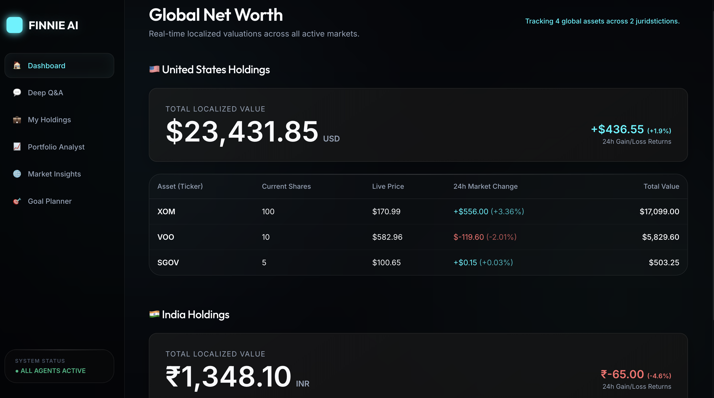
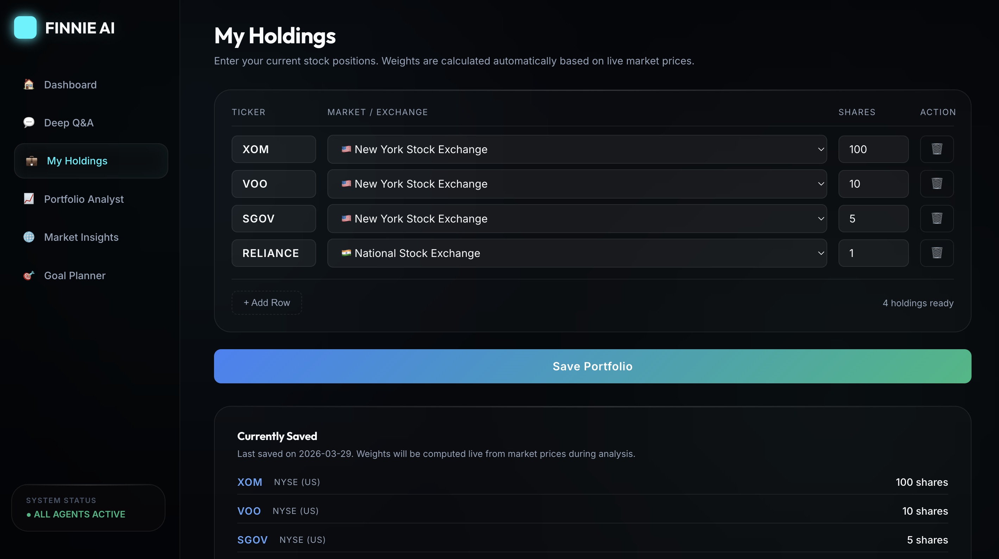
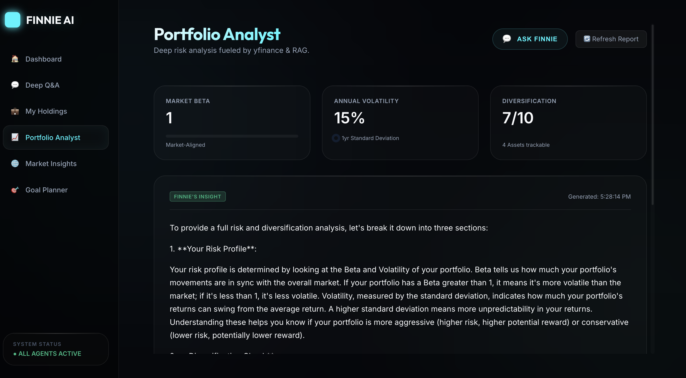
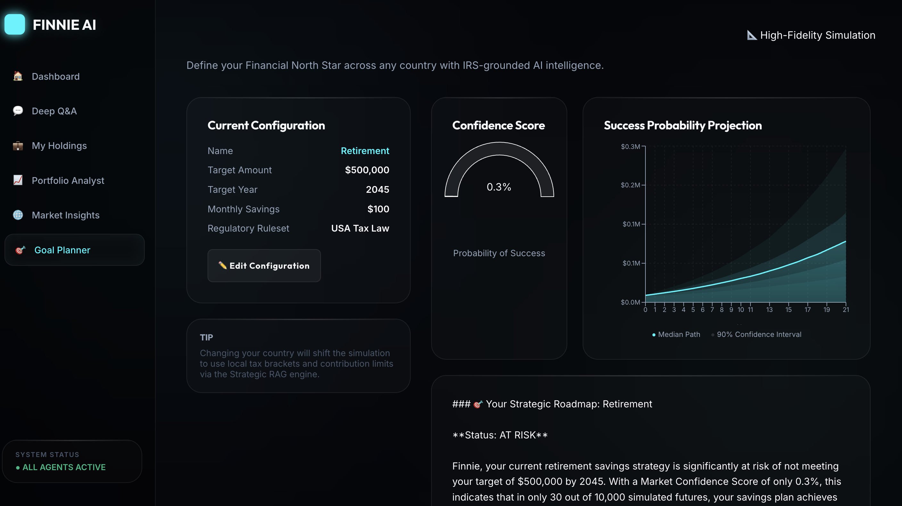
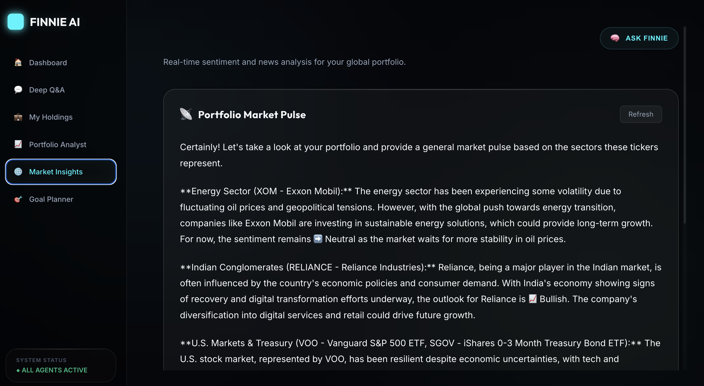

# Finnie AI — UI Preview Gallery & Visual Walkthrough

Welcome to the visual gallery of **Finnie AI**. These high-fidelity screens showcase the **Glass-Finance** design system, component states, and multi-agent financial interfaces in production.

---

## 1. 📊 Executive Edge Dashboard
The primary landing workspace for investors. Built for speed and clarity, the dashboard delivers an instantaneous overview of global wealth holdings, daily P&L fluctuations, and asset allocations with **zero LLM latency** by fetching batched quotes directly.

- **Key Highlights**: Real-time net portfolio value, daily gain/loss trend pills, multi-market asset breakdown, and quick stats.
- **Underlying Specification**: [`specs/baseline/SPEC-05-EXECUTIVE-DASHBOARD.md`](file:///Users/prajosh/Development/finnie-ai/specs/baseline/SPEC-05-EXECUTIVE-DASHBOARD.md)

---

## 2. 💼 My Holdings & Portfolio Manager
The operational portfolio table displaying tenant-isolated equity and ETF holdings across global exchanges (US, NSE India, London FTSE, TSX Canada, DAX Germany).

- **Key Highlights**: Multi-tenant data isolation, in-memory duplicate consolidation, composite unique constraint enforcement (`uq_user_ticker_exchange`), dynamic country flags, and real-time asset allocation charts.
- **Underlying Specification**: [`specs/baseline/SPEC-01-AUTH-MULTI-TENANCY.md`](file:///Users/prajosh/Development/finnie-ai/specs/baseline/SPEC-01-AUTH-MULTI-TENANCY.md)

---

## 3. 🌍 Multi-Market Portfolio Analyst
Institutional-grade portfolio diagnostics powered by LangGraph. Benchmarks domestic equities against their local market indices and analyzes risk metrics.

- **Key Highlights**:
  - Country-aware benchmark routing (`^GSPC` for US, `^NSEI` for India, `^FTSE` for UK, `^GSPTSE` for Canada, `^GDAXI` for Germany, `ALL` for blended).
  - Herfindahl-Hirschman Index (HHI) sector diversification scoring with a 3-attempt exponential backoff scraper retry engine.
  - Formatted 3-card strategic AI insights: 📈 **Risk Profile**, 🎯 **Diversification & Balance**, and 💡 **Action Plan**.
  - Mandatory regulatory `$NFA` disclaimer enforcement.
- **Underlying Specification**: [`specs/baseline/SPEC-02-PORTFOLIO-ANALYST.md`](file:///Users/prajosh/Development/finnie-ai/specs/baseline/SPEC-02-PORTFOLIO-ANALYST.md)

---

## 4. 🎯 Goal Strategist (Financial GPS)
Interactive long-term wealth roadmap planning driven by advanced quantitative modeling and statutory tax knowledge.

- **Key Highlights**:
  - **10,000-iteration geometric Brownian motion Monte Carlo simulations** parameterized by live portfolio risk (Beta & Volatility).
  - Monotonic percentile invariants ($P_{05} \le \text{Median} \le P_{95}$) plotted on an interactive Recharts probability fan chart.
  - Regional statutory tax RAG (`goal_rules` collection in ChromaDB) for 2026 IRS 401(k)/IRA contribution caps or India Section 80C limits.
  - Native [`RoadmapRenderer.tsx`](file:///Users/prajosh/Development/finnie-ai/frontend/src/components/Goals/RoadmapRenderer.tsx) markdown engine rendering glowing status badges (`● ON TRACK`, `▲ CAUTION`, `■ AT RISK`) and milestone action cards.
- **Underlying Specification**: [`specs/baseline/SPEC-03-GOAL-STRATEGIST.md`](file:///Users/prajosh/Development/finnie-ai/specs/baseline/SPEC-03-GOAL-STRATEGIST.md)

---

## 5. 📡 Real-Time Market Insights
Real-time headline monitoring and sentiment analysis for portfolio positions.

- **Key Highlights**:
  - Live Alpha Vantage news and sentiment ingestion mapped to exchange-normalized ticker symbols (e.g. `RELIANCE.NS`).
  - Sentiment classification into actionable signals: 📈 **Bullish**, 📉 **Bearish**, and ➡️ **Neutral**.
  - **30-Minute SQLite `MarketCache` Layer**: Protects API quotas and prevents latency spikes with timezone-aware UTC expiration.
  - Integrated with the compliance guardian node.
- **Underlying Specification**: [`specs/baseline/SPEC-04-MARKET-INSIGHTS.md`](file:///Users/prajosh/Development/finnie-ai/specs/baseline/SPEC-04-MARKET-INSIGHTS.md)

---

## 6. 🧠 Deep Q&A Financial Worker
Interactive conversational assistant grounded in curated financial and tax textbooks from Investor.gov, the SEC, and Vanguard research.

- **Key Highlights**:
  - Supervisor Intent Router classifies financial queries and dispatches to the specialized Financial Q&A node.
  - 3-collection ChromaDB vector store eliminates LLM hallucinations.
  - Embedded inside the persistent sidebar for seamless side-by-side analysis across any tab.
- **Underlying Architecture**: [`docs/ARCHITECTURE.md`](file:///Users/prajosh/Development/finnie-ai/docs/ARCHITECTURE.md) and [`docs/KNOWLEDGE_BASE_AND_RAG.md`](file:///Users/prajosh/Development/finnie-ai/docs/KNOWLEDGE_BASE_AND_RAG.md)

---

> ℹ️ **Design System Tokens**: For CSS variable specifications, glassmorphism tokens, and accessibility standards, refer to [`docs/UI_DESIGN_SYSTEM.md`](file:///Users/prajosh/Development/finnie-ai/docs/UI_DESIGN_SYSTEM.md).
