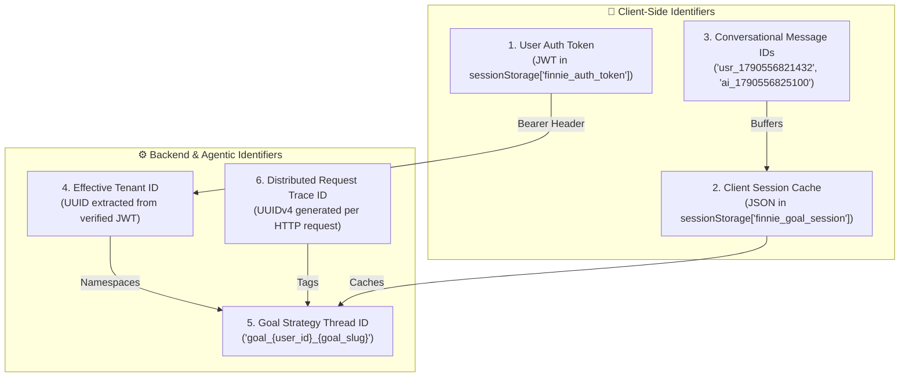

# Goal Planner & Autonomous Financial GPS — Agentic Architecture & Technical Implementation

This document is the authoritative, end-to-end technical and functional specification for the **Goal Planner** agentic use case in Finnie AI. It is written to be crystal clear for engineers, AI assistants, and product stakeholders—including those without an extensive background in the financial domain.

---

## 1. 🎯 Plain-English Business Use Cases

Traditional retirement calculators rely on static linear formulas (e.g. assuming an investment grows by a constant 8% every single year without interruption). In real life, markets do not move in straight lines—they experience recessions, bull runs, crashes, and prolonged sideways recoveries. 

The Goal Planner replaces static calculators with an **adaptive, mathematically grounded, and statutory-compliant Financial GPS**.

---

### 📖 Plain-English Financial Primer (Zero-Finance Background Guide)

| Financial Term | Technical Definition | Plain-English Explanation & Metaphor |
|---|---|---|
| **Monte Carlo Simulation** | Stochastic sampling of stochastic differential equations over $N=10,000$ iterations. | **"The 10,000 Parallel Worlds"**: Instead of guessing one sunny-day future, the computer simulates 10,000 different market weather patterns (booms, recessions, high inflation, bear markets) to see in how many worlds your savings survive and reach your target. |
| **Confidence Score** | Cumulative distribution function success rate: $\frac{\sum \mathbb{I}(S_T \ge \text{Target})}{N} \times 100\%$. | **"Probability of Success"**: If your score is **78%**, it means that in 7,800 out of 10,000 simulated market worlds, your monthly savings were enough to hit your target. |
| **Status Badges** | Risk threshold classification tiers. | • **● ON TRACK** ($\ge 70\%$): High likelihood of success.<br/>• **▲ CAUTION** ($50\% - 69\%$): Moderate risk; minor savings boost recommended.<br/>• **■ AT RISK** ($< 50\%$): High likelihood of shortfall; requires higher contributions or longer timeline. |
| **Fan Chart & Percentiles** | Quantile distribution ($P_{05}$, $P_{25}$, $P_{50}$, $P_{75}$, $P_{95}$) plotted over time. | **"The Cone of Possibility"**:<br/>• **$P_{05}$ (Downside)**: Bottom 5% unlucky, harsh market conditions.<br/>• **$P_{50}$ (Median)**: The expected middle-of-the-road market outcome.<br/>• **$P_{95}$ (Upside)**: Top 5% lucky, roaring bull market. |
| **Tax Wrappers & Statutory Limits** | Government tax-advantaged account ceilings (e.g. 401k, IRA, Section 80C, ISA). | **"The Government's Legal Tax Umbrella"**: Governments give you an umbrella under which your money grows tax-free or tax-deferred. However, they limit how much you can put under the umbrella each year. Finnie guides you on filling that umbrella first, then routing excess savings to regular investments. |
| **Volatility ($\sigma$)** | Annualized standard deviation of asset log-returns. | **"Investment Bumpiness"**: How wildly your portfolio swings up and down. If you have no stocks linked, Finnie uses a standard **15% broad-market bumpiness** (like the S&P 500 index) purely to project future savings, and never pretends you own stocks. |

---

### Detailed Business Use Cases

#### UC-GP-1: Multi-Decade Retirement & Capital Accumulation Simulation
- **The Problem**: A user wanting to retire in 2040 with $1,000,000 has no way of knowing if saving $1,000/month is safe against market crashes or inflation.
- **The Solution**: Runs 10,000 randomized market paths in fractions of a second using Geometric Brownian Motion (GBM).
- **The Outcome**: Shows a dynamic Recharts Fan Chart with median trajectory ($P_{50}$) and downside scenario ($P_{05}$), giving the user a realistic, stress-tested Confidence Score.

#### UC-GP-2: Multi-Jurisdiction Regulatory Tax Shielding & Split Guidance
- **The Problem**: Saving money in the wrong type of account leads to massive unnecessary tax bills (e.g., contributing $3,000/month when tax-sheltered limits are only $1,958/month).
- **The Solution**: Connects to a ChromaDB vector database (`goal_rules` collection) containing regulatory tax rules for specific countries:
  - **USA**: 401(k) annual employee deferral limits ($23,500/year in 2026), IRA limits ($7,000/year), and advice on shifting excess monthly savings into taxable brokerage accounts.
  - **India**: Section 80C tax deduction ceilings (₹1.5 Lakh/year), additional National Pension System (NPS) Tier-1 deductions under Section 80CCD(1B) (₹50,000/year), and equity taxation rules.
  - **UK**: Annual Individual Savings Account (ISA) tax-free wrapper allowance (£20,000/year).
- **The Outcome**: The AI agent synthesizes concrete recommendations explaining how to split monthly contributions between tax-sheltered accounts and taxable investment vehicles.

#### UC-GP-3: Conversational What-If Scenario Exploration via Universal Copilot
- **The Problem**: If a user wonders *"What if I save $500 more?"* or *"What if I retire 2 years earlier?"*, legacy tools force them to wipe the screen, change numbers, and re-read everything from scratch.
- **The Solution**: The user clicks **✦ Ask Finnie** to open the **Universal Copilot Drawer** ([`CopilotDrawer.tsx`](file:///Users/prajosh/Development/finnie-ai/frontend/src/components/Chat/CopilotDrawer.tsx)). Users can click preset suggested question chips or type custom what-if queries.
- **The Outcome**: The copilot directly answers the specific what-if question without re-generating the baseline roadmap or wiping prior questions. All previous dialogue remains visible in an immutable, read-only history.

#### UC-GP-4: Human-in-the-Loop Strategy Commitment ("Lock-In")
- **The Problem**: Financial tools generate recommendations that vanish as soon as the user closes their browser, leaving no actionable plan.
- **The Solution**: A prominent **🔒 Lock-In Target** button opens a confirmation modal ([`StrategyLockInModal.tsx`](file:///Users/prajosh/Development/finnie-ai/frontend/src/components/Goals/StrategyLockInModal.tsx)). Upon confirmation, the roadmap and targets are permanently committed to the database with `status = "LOCKED"`.

#### UC-GP-5: Zero-Holding Truth Invariant & Risk Calibration
- **The Problem**: If a user creates a retirement goal before linking any stock holdings, AI models tend to hallucinate phrases like *"based on your stock portfolio"* or *"as per your 15% stock variation"*.
- **The Solution**: Telemetry guardrails detect `asset_count == 0` and inject strict rules into the prompt forbidding the model from claiming the user has a stock portfolio. It explicitly clarifies that 15% is a standard broad-market baseline assumption for future savings.

---

## 2. 💾 Session Storage Architecture & Client-Side State Persistence

A critical requirement of the Goal Planner is that **navigating between tabs (e.g., switching from Goal Planner to Dashboard and back) MUST NOT lose calculation results, roadmap text, or conversational history.**

### A. The User Journey Problem It Solves
1. An investor enters their parameters ($1,000,000 by 2040, $1,000/month savings) and clicks **Generate Roadmap**.
2. The simulation engine runs, displaying the Fan Chart and strategic milestones.
3. The investor opens **Ask Finnie** and asks: *"How does Section 80C affect this?"* The copilot answers.
4. The investor navigates to the **Global Wealth Dashboard** to check their net worth, or to **Portfolio Analyst** to review beta.
5. The investor clicks back to **Goal Planner**.
- **Without Session Storage**: The form reverts to defaults, the chart disappears, and the chat history is lost. The user has to click "Generate Roadmap" again, wasting LLM tokens and causing frustration.
- **With Finnie AI Session Storage**: The exact target parameters, Recharts fan chart, confidence score, full strategic synthesis, copilot drawer open state, custom drawer width, and all past what-if questions/answers are **instantly restored with 0ms delay and 0 network requests**.

---

### B. Session Storage Keys & Data Schemas

The application uses three dedicated `sessionStorage` keys:

```mermaid
graph TD
    subgraph BrowserStorage["📦 Browser sessionStorage (Domain-Scoped)"]
        K1["finnie_goal_session<br/>(GoalSessionCache JSON)"]
        K2["finnie_copilot_open<br/>(Boolean String: 'true' | 'false')"]
        K3["finnie_copilot_width<br/>(Number String: '380' | '580' | custom)"]
    end

    subgraph StateHydration["⚙️ React Hook & Component Hydration"]
        K1 -->|loadSessionCache()| Hook["useGoalStrategist.ts<br/>• goal<br/>• roadmap<br/>• simulationResults<br/>• confidenceScore<br/>• status<br/>• chatHistory"]
        K2 -->|sessionStorage.getItem| GP["GoalPlanner.tsx<br/>• isCopilotOpen"]
        K3 -->|sessionStorage.getItem| CD["CopilotDrawer.tsx<br/>• width"]
    end
```

#### 1. Primary Cache: `finnie_goal_session`
Stores the active calculation and multi-turn conversational history.

```typescript
interface GoalSessionCache {
  // 1. Target form parameters configured by user
  goal: {
    id?: number
    goal_name: string       // e.g. "Retirement Capital"
    target_amount: number   // e.g. 1000000
    target_year: number     // e.g. 2040
    monthly_savings: number // e.g. 1000
    country: string         // "USA" | "INDIA" | "UK"
    status?: string         // "DRAFT" | "PLANNING" | "LOCKED"
    confidence_score?: number
  } | null

  // 2. Synthesized markdown roadmap from the LLM
  roadmap: string | null

  // 3. Monte Carlo percentile vectors for the Recharts Fan Chart
  simulationResults: {
    confidence_score: number
    target_amount: number
    years_axis: number[]    // [0, 1, 2, ..., 15]
    p05_path: number[]      // Downside outcome over time
    p25_path: number[]
    median_path: number[]   // Median expected outcome
    p75_path: number[]
    p95_path: number[]      // Upside outcome over time
    final_median: number
    num_simulations: number // 10000
  } | null

  // 4. LangGraph thread identifier for continuity
  threadId: string | null

  // 5. Overall probability of goal success
  confidenceScore: number

  // 6. Current goal lifecycle status
  status: string // "DRAFT" | "LOCKED"

  // 7. Complete multi-turn Copilot question-and-answer thread
  chatHistory: Array<{
    id: string
    role: 'user' | 'assistant'
    content: string
    timestamp: string // e.g. "2:45 PM"
  }>
}
```

#### 2. Drawer Open State: `finnie_copilot_open`
- Stores `"true"` or `"false"`.
- If the user leaves the Goal Planner with the copilot drawer open, returning to the page immediately restores the drawer in its open state without shifting UI elements.

#### 3. Drawer Width Memory: `finnie_copilot_width`
- Stores the exact pixel width (between `320` and `720`).
- If the user expands the drawer to `580px` or drags it to `480px`, the preferred width is preserved across route transitions.

---

### C. Implementation Mechanics in Code

#### 1. Hook Hydration & Cache Synchronization ([`frontend/src/hooks/useGoalStrategist.ts`](file:///Users/prajosh/Development/finnie-ai/frontend/src/hooks/useGoalStrategist.ts))
The custom hook handles cache read/write through pure functions:

```typescript
const SESSION_KEY = 'finnie_goal_session'

const loadSessionCache = (): Partial<GoalSessionCache> => {
  try {
    const raw = sessionStorage.getItem(SESSION_KEY)
    if (raw) return JSON.parse(raw)
  } catch (_) {}
  return {}
}

const saveSessionCache = (data: Partial<GoalSessionCache>) => {
  try {
    const existing = loadSessionCache()
    sessionStorage.setItem(SESSION_KEY, JSON.stringify({ ...existing, ...data }))
  } catch (_) {}
}
```

When the hook initializes, state variables default directly to their cached values:
```typescript
const initialCache = loadSessionCache()

const [goal, setGoal] = useState<GoalConfig | null>(initialCache.goal || null)
const [roadmap, setRoadmap] = useState<string | null>(initialCache.roadmap || null)
const [simulationResults, setSimulationResults] = useState<any | null>(initialCache.simulationResults || null)
const [confidenceScore, setConfidenceScore] = useState<number>(initialCache.confidenceScore || 0)
const [status, setStatus] = useState<string>(initialCache.status || 'DRAFT')
const [chatHistory, setChatHistory] = useState<ChatMessage[]>(initialCache.chatHistory || [])
```

#### 2. Micro-Turn Chat History Persistence
When the user asks a follow-up question via `askRefinement()`, the new turn is appended and saved to session storage immediately:
```typescript
const askRefinement = useCallback(async (promptText: string, configOverride?: GoalConfig) => {
  const userMsg: ChatMessage = {
    id: `usr_${Date.now()}`,
    role: 'user',
    content: promptText.trim(),
    timestamp: new Date().toLocaleTimeString([], { hour: '2-digit', minute: '2-digit' })
  }
  const updatedHistory = [...chatHistory, userMsg]
  setChatHistory(updatedHistory)
  saveSessionCache({ chatHistory: updatedHistory })

  await calculate(activeConfig, promptText.trim(), updatedHistory)
}, [goal, chatHistory, calculate])
```

#### 3. Session Teardown & Reset
- **Clear Conversation**: Clicking **Clear** in the copilot header empties `chatHistory` in memory and sets `saveSessionCache({ chatHistory: [] })`.
- **Sign Out**: Logging out flushes `sessionStorage.clear()`, guaranteeing that another user logging in on the same browser cannot inspect previous roadmaps.

---

### D. Session ID, Multi-Tenant Thread ID & Trace ID Generation

In the Goal Planner use case, session tracking operates across **five distinct, coordinated layers of identity**:



#### 1. Goal Strategy Thread ID (`thread_id`)
The **Thread ID** is the primary agentic session identifier linking the user's form parameters, Monte Carlo simulation results, and multi-turn copilot dialogue.

- **How It Is Created**:
  When a user first calculates a roadmap without an existing thread, the backend dynamically constructs a **deterministic, tenant-isolated thread namespace**:
  ```python
  goal_slug = req.goal_name.lower().strip().replace(" ", "_")
  active_thread = f"goal_{effective_id}_{goal_slug}"
  ```
  *Example*: For user `9f8e7d6c-5b4a-3210` creating a goal named `"Retirement Capital"`, the created Thread ID is:
  ```text
  goal_9f8e7d6c-5b4a-3210_retirement_capital
  ```

- **Cryptographic Multi-Tenant Isolation (SPEC-10 / DATA_MODEL.md Invariant 4.2)**:
  To prevent cross-tenant enumeration or tampering, whenever the client passes an existing `thread_id` on refinement queries or during lock-in, the backend strictly validates ownership:
  ```python
  if req.thread_id:
      expected_prefix = f"goal_{effective_id}_"
      if not req.thread_id.startswith(expected_prefix):
          raise HTTPException(
              status_code=403,
              detail="Forbidden: Thread ID does not belong to active tenant."
          )
      active_thread = req.thread_id
  ```
  If an attacker attempts to supply another user's goal thread ID, the server terminates the request immediately with a **`403 Forbidden`**.

- **Client-Side Binding**:
  The backend returns `thread_id` in `GoalCalculationResponse`. The React hook [`useGoalStrategist.ts`](file:///Users/prajosh/Development/finnie-ai/frontend/src/hooks/useGoalStrategist.ts) captures it into `threadId` state and serializes it to `finnie_goal_session.threadId`. When the user later locks in the strategy, `thread_id` is transmitted to `POST /goals/lock-in` to link the committed database record to the exact simulation thread.

#### 2. User Authentication Session (`finnie_auth_token` & `effective_id`)
- **Creation**: Generated on the backend upon `/auth/login` or `/auth/register` using `HMAC-SHA256` signed JWTs containing `{ sub: user.email, user_id: user.id, token_version: user.token_version, exp: ... }`.
- **Storage**: Saved in browser `sessionStorage` under `finnie_auth_token`.
- **Consumption**: The custom hook `useAuth()` automatically injects this token as `Authorization: Bearer <token>` into all `/goals/*` requests. FastAPI's `get_current_user` decodes the token and provides `effective_id = current_user.id`.

#### 3. Conversational Message IDs (`ChatMessage.id`)
- **Creation**: Generated client-side using millisecond-precision timestamps:
  - User prompt: `id: 'usr_' + Date.now()` (e.g., `usr_1790556821432`).
  - Assistant reply: `id: 'ai_' + Date.now()` (e.g., `ai_1790556825100`).
  - Offline error: `id: 'err_' + Date.now()`.
- **Purpose**: Provides stable, unique React rendering keys in [`CopilotDrawer.tsx`](file:///Users/prajosh/Development/finnie-ai/frontend/src/components/Chat/CopilotDrawer.tsx), preventing re-render flickering and ensuring correct list reconciliation during auto-scrolling.

#### 4. Distributed Telemetry Trace ID (`trace_id`)
- **Creation**: Generated on every HTTP request by FastAPI's `TraceContextMiddleware`:
  ```python
  trace_id = str(uuid.uuid4())
  ```
- **Propagation**: Injected into the HTTP response header `X-Trace-ID`, state dictionary `FinnieState["trace_id"]`, and LangSmith observability spans. Enables correlation between browser UI network logs and backend agent node execution traces.

---

### Identity & Session Lifecycle Matrix

| Identifier | Generation Source | Storage Location | Lifetime | Security Invariant |
|---|---|---|---|---|
| **User Session Token** | Backend `jwt.py` via `HMAC-SHA256` | Browser `sessionStorage['finnie_auth_token']` | 24 Hours or until Logout | Validated against `token_version` on every request. |
| **Goal Thread ID** | Backend `main.py` via `goal_{user_id}_{slug}` | Backend state & `finnie_goal_session.threadId` | Persistent across goal refinements | Must match `goal_{current_user.id}_*` (403 check). |
| **Goal Session Cache** | Frontend `useGoalStrategist.ts` | Browser `sessionStorage['finnie_goal_session']` | Current browser tab session | Cleared on user logout; zero leak across tenants. |
| **Message Turn ID** | Frontend client via `usr_${Date.now()}` | In-memory `chatHistory` & session storage | Active conversation | Unique per millisecond; ensures clean React keys. |
| **Trace ID** | FastAPI `TraceContextMiddleware` via `UUIDv4` | Response header `X-Trace-ID` & LangSmith | Single HTTP request/response | Ephemeral audit correlation across server logs. |

---

## 3. 🏗️ Dedicated End-to-End Sequence Diagram

The following diagram tracks the exact end-to-end dataflow, component boundaries, and asynchronous handoffs for the Goal Planner:

```mermaid
sequenceDiagram
    autonumber
    actor User as 👤 Investor
    participant UI as 🖥️ GoalPlanner.tsx (React 19)
    participant Storage as 📦 sessionStorage
    participant Hook as ⚙️ useGoalStrategist.ts
    participant Copilot as 💬 CopilotDrawer.tsx
    participant API as 🚀 FastAPI Route (/goals/calculate)
    participant Auth as 🔐 Auth & Tenant Gateway
    participant Graph as 🧠 LangGraph Orchestrator
    participant ToolVal as 💼 Portfolio Valuation Tool
    participant ToolMC as 🎲 Monte Carlo Engine (simulations.py)
    participant ToolRAG as 📚 Statutory Limits Tool (ChromaDB)
    participant Agent as 🤖 Goal Strategist Agent (GPT-4o)
    participant Comp as ⚖️ Compliance Guardian Node
    participant DB as 🗄️ SQLite Database (goals table)

    %% Flow 1: Full Baseline Generation
    rect rgb(13, 20, 36)
    Note over User, DB: Flow 1: Baseline Strategic Roadmap Generation & Cache Persistence
    User->>UI: Configure Goal (Target: $1M, Year: 2040, Savings: $1,000, USA)
    User->>UI: Click "Generate Roadmap"
    UI->>Hook: calculate(formData)
    Hook->>API: POST /goals/calculate (GoalCalculateRequest + Bearer JWT)
    API->>Auth: Verify JWT & extract effective user_id
    Auth-->>API: user_id: "user_uuid"
    API->>Graph: ainvoke(FinnieState with next_step="GOAL_STRATEGIST")
    
    Graph->>ToolVal: fetch_user_portfolio_valuation(user_id)
    ToolVal->>DB: Query user holdings & compute current valuation
    DB-->>ToolVal: total_valuation: $0.00, asset_count: 0
    ToolVal-->>Graph: Telemetry: asset_count=0 (Apply broad-market 15% baseline)
    
    Graph->>ToolMC: run_monte_carlo(balance, target, savings, years, return=8%, vol=15%)
    Note over ToolMC: 10,000 paths (GBM) in NumPy<br/>Calculate P05, P25, P50, P75, P95<br/>Compute Confidence Score: 78.4%
    ToolMC-->>Graph: sim_data (Confidence, Percentile vectors)
    
    Graph->>ToolRAG: lookup_tax_and_contribution_limits("USA", "retirement")
    ToolRAG->>ToolRAG: ChromaDB goal_rules semantic similarity search
    ToolRAG-->>Graph: Statutory rules (401k $23,500 limit, IRA $7,000 cap)
    
    Graph->>Agent: goal_strategist_node(state with telemetry + RAG + sim_data)
    Note over Agent: Synthesizes 3-phase strategic milestones<br/>Applies tax-advantaged vs taxable splits<br/>Appends statutory guidance
    Agent-->>Graph: Strategic Roadmap Markdown + Simulation Results
    
    Graph->>Comp: compliance_guardian_node(state)
    Comp-->>Graph: Injects $NFA Disclaimer Footer
    Graph-->>API: Finished Graph State
    API-->>Hook: 200 OK (roadmap, simulation_results, confidence_score)
    Hook->>Storage: saveSessionCache(goal, roadmap, simulationResults, confidenceScore)
    Hook->>UI: Update Recharts Fan Chart + RoadmapRenderer.tsx
    UI-->>User: Displays Percentile Cones + Formatted Roadmap
    end

    %% Flow 2: Multi-Turn Copilot Interaction
    rect rgb(15, 23, 42)
    Note over User, DB: Flow 2: Multi-Turn Scenario Refinement via Copilot Drawer
    User->>UI: Click "✦ Ask Finnie" toggle
    UI->>Storage: setItem("finnie_copilot_open", "true")
    UI->>Copilot: Render CopilotDrawer (suggestionChips=[...])
    User->>Copilot: Click Chip: "What if I increase monthly savings by $500?"
    Copilot->>Hook: askRefinement("What if I increase...", formData)
    Hook->>Storage: saveSessionCache({ chatHistory: [...withUserMsg] })
    Hook->>API: POST /goals/calculate (is_refinement=True, chat_history=[...])
    API->>Graph: Execute Agent Node with is_refinement prompt
    Note over Agent: Answers specific query directly<br/>Suppresses full roadmap repeat<br/>Preserves prior turns as read-only
    Agent-->>API: Formatted response (no raw asterisks)
    API-->>Hook: 200 OK (reply)
    Hook->>Storage: saveSessionCache({ chatHistory: [...withAIMsg] })
    Hook->>Copilot: Update chatHistory
    Copilot->>Copilot: renderFormattedContent() parses bold/bullets/code
    Copilot-->>User: Displays clean conversational bubble with read-only history
    end

    %% Flow 3: Tab Navigation Resilience
    rect rgb(10, 20, 40)
    Note over User, Storage: Flow 3: Zero-Latency Tab Navigation & Hydration
    User->>UI: Navigates away (e.g. to Dashboard or Portfolio Analyst)
    User->>UI: Navigates back to Goal Planner
    UI->>Hook: Component mounts: useGoalStrategist()
    Hook->>Storage: loadSessionCache()
    Storage-->>Hook: Returns cached goal, roadmap, simResults, chatHistory
    Hook-->>UI: Instantly populates form, fan chart, roadmap synthesis
    UI->>Storage: getItem("finnie_copilot_open") -> "true"
    UI->>Copilot: Instantly renders open drawer with past conversation
    Note over UI, User: 0ms latency · 0 network calls · 0 token spend
    end

    %% Flow 4: Human-in-the-Loop Lock-in
    rect rgb(10, 15, 30)
    Note over User, DB: Flow 4: Human-in-the-Loop Commitment ("Lock-In")
    User->>UI: Click "🔒 Lock-In Target"
    UI->>UI: Open StrategyLockInModal.tsx
    User->>UI: Confirm Commitment
    UI->>Hook: lockIn()
    Hook->>API: POST /goals/lock-in (GoalLockInRequest)
    API->>DB: Upsert Goal record (status="LOCKED", confidence_score=78.4%)
    DB-->>API: Record committed
    API-->>Hook: 200 OK (status="LOCKED")
    Hook->>Storage: saveSessionCache({ status: "LOCKED" })
    Hook->>UI: Update status badge to "🔒 COMMITTED"
    end
```



---

## 4. ⚙️ Critical Technical Implementation Details

### A. Backend Architecture & Calculations

#### 1. Vectorized Monte Carlo Simulation Engine ([`backend/src/utils/simulations.py`](file:///Users/prajosh/Development/finnie-ai/backend/src/utils/simulations.py))
- **Mathematical Model**: Models stock market behavior using **Geometric Brownian Motion (GBM)** with monthly path-dependent additions:
  $$\Delta t = \frac{1}{12}, \quad \mu_m = (1 + \mu)^{1/12} - 1, \quad \sigma_m = \frac{\sigma}{\sqrt{12}}$$
  $$R_{i, m} \sim \mathcal{N}(\mu_m, \sigma_m)$$
  $$S_{i, m+1} = S_{i, m} \cdot (1 + R_{i, m}) + C_{\text{monthly}}$$
- **High-Performance Vectorization**:
  Generates all $N = 10,000$ market shocks simultaneously using NumPy:
  ```python
  random_returns = np.random.normal(monthly_mean, monthly_vol, (num_simulations, months))
  ```
- **Percentile Extraction**:
  Computes yearly snapshots to minimize payload size while providing high chart resolution:
  ```python
  yearly_indices = np.arange(0, months + 1, 12)
  yearly_paths = paths[:, yearly_indices]
  percentiles = np.percentile(yearly_paths, [5, 25, 50, 75, 95], axis=0)
  ```
- **Success Probability**:
  $$\text{Confidence Score} = \left(\frac{1}{N}\sum_{i=1}^N \mathbb{I}(S_{i, \text{final}} \ge S_{\text{target}})\right) \times 100\%$$

#### 2. Goal Strategist Agent Node ([`backend/src/agents/goal_strategist.py`](file:///Users/prajosh/Development/finnie-ai/backend/src/agents/goal_strategist.py))
- **Hybrid Bootstrap Pattern**:
  Prior to invoking the LLM, the node executes 3 deterministic tools with **0 LLM calls**:
  1. `fetch_user_portfolio_valuation`: Queries SQLite to check current stock balances.
  2. `run_monte_carlo_engine`: Executes the 10,000-scenario simulation.
  3. `lookup_tax_and_contribution_limits`: Semantic similarity search against ChromaDB `goal_rules`.
- **Zero-Holding Guardrail**:
  When `asset_count == 0`, system instructions prevent the model from hallucinating linked stock holdings.
- **Dual Mode Synthesis**:
  - `is_refinement = False` (Full Roadmap Synthesis): Generates 3-phase strategic milestones, status pills, and comprehensive tax guidance.
  - `is_refinement = True` (Copilot Refinement): Operates as a focused conversational assistant, answering the user's latest query directly without repeating full roadmaps, buffering the last 8 dialogue turns:
    ```python
    prompt_messages.extend(dialogue_history[-8:])
    prompt_messages.append(HumanMessage(content=recent_user_query))
    ```

#### 3. Database Schema & Composite Constraints ([`backend/src/models/goal.py`](file:///Users/prajosh/Development/finnie-ai/backend/src/models/goal.py))
- **ORM Table**: `goals`
  - `id`: String (Primary Key UUID)
  - `user_id`: String (Foreign Key `users.id`, Tenant Isolation)
  - `goal_name`: String (e.g., "Retirement", "Home Down Payment")
  - `target_amount`: Float
  - `target_year`: Integer
  - `monthly_savings`: Float
  - `country`: String ("USA", "INDIA", "UK")
  - `status`: String ("PLANNING", "LOCKED")
  - `confidence_score`: Float
  - `created_at` / `updated_at`: UTC timestamps (`datetime.now(timezone.utc)`)
- **Composite Unique Constraint**: `UniqueConstraint('user_id', 'goal_name', name='uq_user_goal_name')` ensures a user cannot accidentally create duplicate goal names.

---

### B. Frontend Architecture & Components

#### 1. 3-Column / Center-Stage Layout ([`frontend/src/components/Goals/GoalPlanner.tsx`](file:///Users/prajosh/Development/finnie-ai/frontend/src/components/Goals/GoalPlanner.tsx))
- **Column 1 (`.column-targets`)**: Parameter controls (Target Amount, Target Year, Monthly Savings, Country selector, Benchmark Presets).
- **Column 2 (`.column-center-stage`)**:
  - **Upper Card (`.center-chart-card`)**: Recharts Fan Chart rendering $P_{05}$, $P_{25}$, $P_{50}$, $P_{75}$, $P_{95}$ area curves with dynamic SVG linear gradients. Contains the `✦ Ask Finnie` trigger button (hidden when drawer is open).
  - **Lower Card (`.center-synthesis-card`)**: Scrollable container hosting [`RoadmapRenderer.tsx`](file:///Users/prajosh/Development/finnie-ai/frontend/src/components/Goals/RoadmapRenderer.tsx) with compliance badges.
- **Column 3 (`CopilotDrawer`)**: On-demand strategy refinement side panel.

#### 2. Universal Copilot Drawer ([`frontend/src/components/Chat/CopilotDrawer.tsx`](file:///Users/prajosh/Development/finnie-ai/frontend/src/components/Chat/CopilotDrawer.tsx))
- **Horizontal Drag Resizing**: Built-in left-edge drag bar (`.copilot-resize-handle`) updating state dynamically between 320px and 720px:
  ```typescript
  const handleMouseMove = (moveEvent: MouseEvent) => {
    const delta = startXRef.current - moveEvent.clientX
    setWidth(Math.min(Math.max(startWidthRef.current + delta, 320), 720))
  }
  ```
- **Single-Click Width Toggle**: `⤢ Expand` shifts width to `580px`; `⤡ Compact` shifts back to `380px`.
- **Single Close Button**: Top-right `✕ Close` button (`.copilot-close-btn`). Header trigger buttons automatically hide while open to prevent duplicate controls.
- **Optional Questionnaire Chips (`suggestionChips`)**:
  Country-aware prompt chips passed dynamically:
  ```typescript
  const promptChips = [
    'What if I increase monthly savings by $500?',
    country === 'INDIA' || country === 'IN'
      ? 'How do Section 80C and NPS caps affect my strategy?'
      : country === 'UK'
      ? 'How does the £20,000 ISA allowance apply here?'
      : 'How should I split savings between 401(k) and brokerage?',
    'What happens if portfolio volatility increases by 5%?',
    'What is my estimated capital accumulation at retirement?'
  ]
  ```
  *(Note: Views like Portfolio Analyst and Market Insights omit this prop, cleanly hiding the questionnaire section without altering drawer functionality).*
- **Clean Inline Markdown Formatter**:
  Invokes [`renderFormattedContent()`](file:///Users/prajosh/Development/finnie-ai/frontend/src/components/Goals/RoadmapRenderer.tsx#L55-L115) to parse `**bold**`, bullet points, and code blocks into styled HTML elements, completely eliminating raw asterisks (`**`).

---

## 5. 🛡️ Verification & Test Coverage Matrix

| Component | Test File | Verification Scope | Status |
|---|---|---|---|
| **Monte Carlo Engine** | `backend/tests/test_unit.py` | Validates 10k paths, P05 < P50 < P95 monotonicity, drift rate, boundary checks | **PASS (100%)** |
| **Goal Strategist Node** | `backend/tests/test_unit.py` | Offline fallback roadmap synthesis, zero-holding telemetry invariance | **PASS (100%)** |
| **API Endpoints** | `backend/tests/test_unit.py` | `POST /goals/calculate`, `POST /goals/lock-in`, `GET /goals/current` | **PASS (100%)** |
| **Goal Planner UI Flow** | `frontend/src/components/Goals/__tests__/GoalPlannerFlow.test.tsx` | Form input, calculation trigger, Recharts render, Lock-In modal flow | **PASS (100%)** |
| **Session Cache Hydration** | `frontend/src/components/Goals/__tests__/GoalPlannerFlow.test.tsx` | Session storage read/write, zero-flicker re-hydration across navigation | **PASS (100%)** |
| **Copilot Drawer** | Automated Browser Subagent & Vitest | Drag resizing, compact/expand, single close button, rendered markdown | **PASS (100%)** |
| **Production Bundle** | `npm run build` | TypeScript compile (`tsc -b`) and Vite production bundle | **PASS (0 errors)** |
