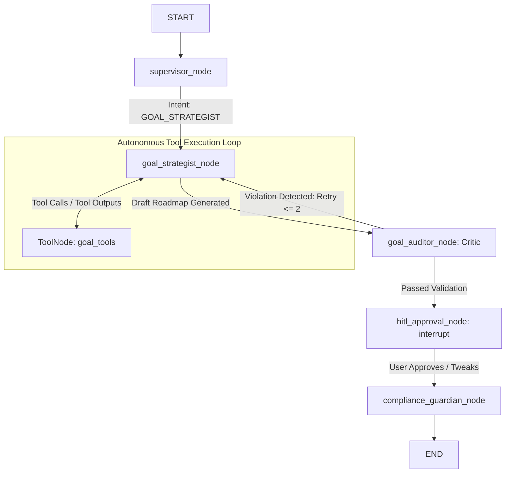

# Feature Spec: SPEC-10 — Autonomous Financial GPS & Multi-Agent Goal Strategist

> **Status**: 🟡 **DRAFT / IN REVIEW**  
> **Author**: Antigravity  
> **Scope**: Backend, LangGraph, Tools, Checkpointing, Frontend Streaming, Security  
> **Target Release**: v0.8.0 (Phase 8)  
> **Target Agent**: `goal_strategist_node` & `goal_auditor_node`

---

## 1. 🎯 Business Objective & Domain Rules

### Problem Statement
The current Goal Strategist implementation ([goal_strategist.py](file:///Users/prajosh/Development/finnie-ai/backend/src/agents/goal_strategist.py)) operates as a **single-shot, deterministic script**. The Python backend runs the Monte Carlo engine and ChromaDB queries before the LLM is invoked, passing raw text into a static prompt. 

This presents critical product and architectural limitations:
1. **No Autonomous Decision-Making**: The LLM cannot query additional data or adjust simulation assumptions dynamically.
2. **Conversational Amnesia**: The user cannot ask iterative questions (e.g. *"What if I can only save $300 instead?"* or *"What if inflation spikes to 4%?"*) without re-entering all inputs.
3. **Absence of Feasibility Verification (No Critic)**: If the LLM generates savings advice that violates statutory tax limits (e.g. recommending $30,000/yr into a standard 401(k)), the plan is passed directly to the user.
4. **No Human-in-the-Loop (HITL) Controls**: Recommended strategies are not subject to explicit user review/confirmation before saving.
5. **Static Loading Spinners**: Long simulation and RAG queries freeze the UI behind a CSS spinner without transparency into agent reasoning.

### Domain Rules & Invariants
- **Dynamic Tool Calling**: The agent must autonomously decide which tools to execute (`fetch_user_portfolio`, `run_monte_carlo_engine`, `lookup_tax_and_contribution_limits`).
- **Mathematical Grounding**: Monte Carlo outputs (confidence score, median outcome, 10th/90th percentile) must originate strictly from the math engine, never hallucinated by the LLM.
- **Reflection & Regulatory Sanity**: The `goal_auditor_node` (critic) must verify that recommended annual savings do not exceed jurisdiction-specific retirement contribution caps (IRS 401(k) / IRA, India Section 80C) before approving the strategy.
- **Compliance & Multi-Tenancy**:
  - Mandatory routing through `compliance_guardian_node` to append `$NFA` disclaimers.
  - Multi-tenant tenant isolation: `user_id` derived exclusively from `current_user: User = Depends(get_current_user)`.

---

## 2. 🔌 Technical Contracts & Architecture

### A. Modular Tool Manifest (`backend/src/tools/goal_tools.py`)
Modular `@tool` definitions registered with LangChain schemas:

```python
@tool
def fetch_user_portfolio_valuation(user_id: str) -> dict:
    """Fetches the active user's total portfolio valuation across all holdings."""

@tool
def run_monte_carlo_engine(
    initial_balance: float,
    target_amount: float,
    monthly_savings: float,
    years: int,
    expected_return: float = 0.08,
    volatility: float = 0.15
) -> dict:
    """Executes 10,000 Monte Carlo simulation runs and returns confidence score, median, and percentiles."""

@tool
def lookup_tax_and_contribution_limits(country: str, topic: str) -> str:
    """Queries ChromaDB 'goal_rules' vector collection for country-specific retirement and tax contribution ceilings."""
```

### B. Agent Topology & LangGraph Wiring (`backend/src/graph.py`)



1. **`goal_strategist_node`**:
   - Initialized with `.bind_tools([fetch_user_portfolio_valuation, run_monte_carlo_engine, lookup_tax_and_contribution_limits])`.
   - Iterates through tool calls until reasoning is complete.
2. **`goal_auditor_node` (Reflection/Critic)**:
   - Validates that recommended monthly savings $\times 12 \le \text{Annual Tax Limits}$.
   - If limits are violated: sets `state["critic_feedback"]` and loops back to `goal_strategist_node` (capped at 2 retries).
3. **`hitl_approval_node` (Human-in-the-Loop)**:
   - Invokes LangGraph `interrupt()`:
     ```python
     decision = interrupt({
         "type": "CONFIRM_STRATEGY",
         "target_amount": target,
         "monthly_savings": savings,
         "confidence_score": confidence
     })
     ```
4. **State Checkpointing**:
   - `workflow.compile(checkpointer=SqliteSaver.from_conn_string("finnie_checkpoints.db"))`.
   - Invocations specify `config={"configurable": {"thread_id": f"goal_{user_id}_{goal_id}"}}`.

### C. API Endpoints (`backend/main.py`)

1. **`POST /goals/calculate`**:
   - Standard execution or resumption of the goal strategist graph.
   - Body: `GoalCalculationRequest(target_amount, target_year, monthly_savings, country, goal_name, thread_id)`.
2. **`POST /goals/calculate/stream`**:
   - Server-Sent Events (SSE) streaming intermediate events (`on_tool_start`, `on_tool_end`, `on_chat_model_stream`).
3. **`POST /goals/approve`**:
   - Resumes graph from HITL interrupt:
   - Body: `GoalApprovalRequest(thread_id: str, approved: bool, user_adjustments: Optional[dict])`.

---

## 3. 🖥️ Frontend Presentation & State

### A. Route & Configuration
- Add to `src/config.ts`:
  ```typescript
  GOALS_CALCULATE: `${API_BASE}/goals/calculate`,
  GOALS_STREAM: `${API_BASE}/goals/calculate/stream`,
  GOALS_APPROVE: `${API_BASE}/goals/approve`,
  ```

### B. Custom Hook Layer (`src/hooks/useGoalStrategist.ts`)
- Manages:
  - `threadId`: Preserved per session/goal to support conversational refinements.
  - `thoughtStream`: Array of intermediate agent steps (e.g. `[{ step: 'tools', message: 'Simulating 10,000 market paths...' }]`).
  - `pendingApproval`: Populated when the graph hits an `interrupt()`.
  - `approveStrategy(adjustments?: GoalAdjustments)`: Dispatches approval payload to `/goals/approve`.

### C. Component Presentation (`src/components/Goals/`)
1. **Live Thought Badges (`ThoughtStream.tsx`)**:
   - Displays real-time progress chips (e.g. `🔍 Fetching Holdings` ➔ `🎲 Running Monte Carlo` ➔ `⚖️ Auditing IRS Limits`).
2. **Strategy Confirmation Card (`StrategyApprovalModal.tsx`)**:
   - Appears when `pendingApproval` is received.
   - Highlights: Target, Horizon, Required Savings, Projected Confidence.
   - Actions: **[Lock In Strategy]** or **[Tweak Assumptions]**.
3. **Roadmap & Monte Carlo Chart**:
   - Renders Fan Chart and confidence gauge upon graph completion.

---

## 4. 🛡️ Edge Cases, Failure Modes & Resilience

| Scenario | Defensive Mechanism |
|---|---|
| **ChromaDB / Tax RAG Down** | Tool catches error and returns standard default statutory limits without terminating graph. |
| **Monte Carlo Horizon <= 0** | Tool rejects zero/negative duration and sets minimum 1-year horizon defensively. |
| **Critic Infinite Loop** | Strict 2-retry counter in `state["critic_retry_count"]`. On 3rd failure, routes to compliance with a cautionary disclaimer. |
| **Stale / Abandoned HITL State** | Threads persist in SQLite checkpointer; users can return days later to resume or restart. |

---

## 5. ✅ Acceptance Criteria & Test Plan

### A. Automated Backend Unit Tests (`backend/tests/test_unit.py`)
- [ ] **AC-1 (Tools)**: `run_monte_carlo_engine` returns confidence score, median, and trajectories with valid bounds.
- [ ] **AC-2 (Tool Binding)**: `goal_strategist_node` successfully generates tool calls when given ungrounded goal inputs.
- [ ] **AC-3 (Critic / Reflection)**: `goal_auditor_node` rejects roadmaps proposing savings $> \$23,500$ for US 401(k) and decrements retry budget.
- [ ] **AC-4 (Checkpointer Memory)**: Re-invoking graph with identical `thread_id` and query *"Now change target year to 2040"* retains prior initial balance and goal name without re-prompting.
- [ ] **AC-5 (HITL Interruption)**: Graph execution pauses at `hitl_approval_node` and successfully resumes upon receiving `Command(resume=...)`.
- [ ] **AC-6 (Compliance)**: Final output always includes `$NFA` disclaimer.

### B. Frontend Verification
- [ ] **AC-7**: `ThoughtStream` renders agent reasoning badges in real time during SSE stream.
- [ ] **AC-8**: `npm test` and `npm run build` pass with 0 errors and 0 warnings.
