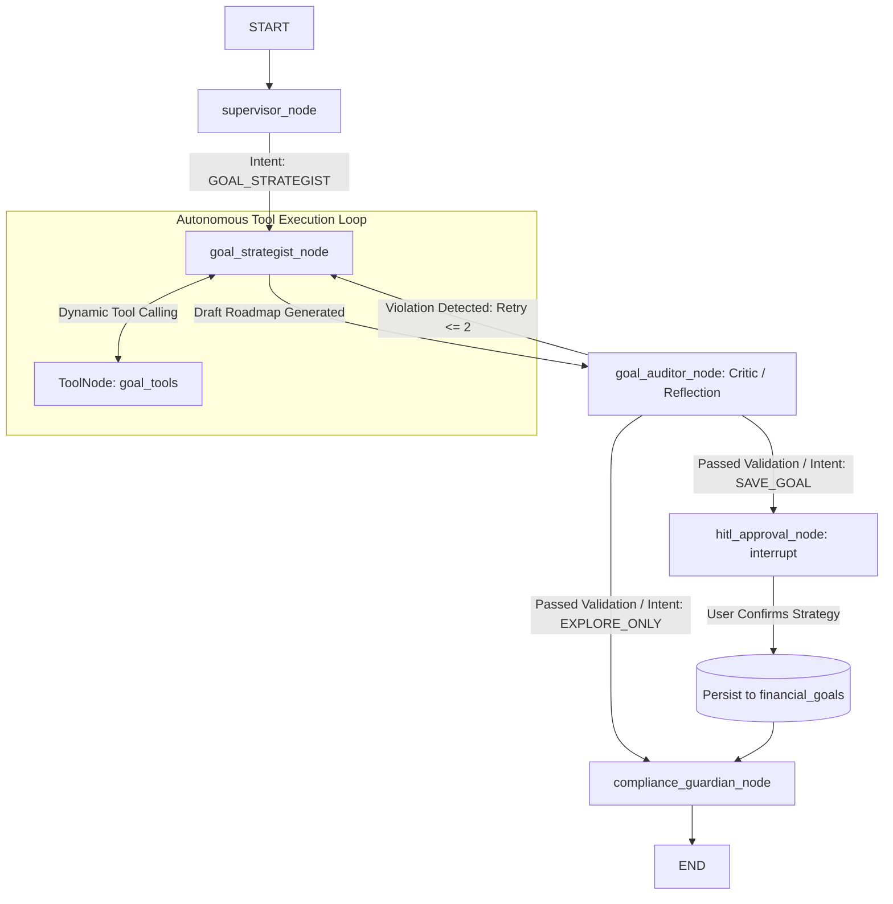

# Feature Spec: SPEC-10 — Autonomous Financial GPS & Multi-Agent Goal Strategist

> **Status**: 🟡 **READY FOR IMPLEMENTATION**  
> **Author**: Antigravity & Lead Engineer  
> **Scope**: Backend, LangGraph, Tools, Checkpointing, Frontend Streaming, HITL, Security, Data Modeling  
> **Target Release**: v0.8.0 (Phase 8)  
> **Target Agent**: `goal_strategist_node` & `goal_auditor_node`  
> **Future Companion**: SPEC-11 (Cross-Session Long-Term Memory & Global Profile Store)

---

## 1. 🎯 Business Objective & Domain Rules

### Problem Statement
The current Goal Strategist implementation ([goal_strategist.py](file:///Users/prajosh/Development/finnie-ai/backend/src/agents/goal_strategist.py)) operates as a **single-shot, deterministic script**. The Python backend runs the Monte Carlo engine and ChromaDB queries before the LLM is invoked, passing raw text into a static prompt.

This presents critical product and architectural limitations:
1. **No Autonomous Decision-Making**: The LLM cannot query additional data or stress-test alternative savings scenarios dynamically.
2. **Conversational Amnesia**: The user cannot ask iterative what-if questions (e.g. *"What if I can only save $300 instead?"* or *"What if I relocate to India in 2028?"*) without re-entering all inputs from scratch.
3. **Absence of Feasibility Verification (No Critic)**: If the LLM generates savings advice that violates statutory tax limits (e.g. recommending $30,000/yr into a standard US 401(k)), the plan is passed directly to the user.
4. **No Explicit Human-in-the-Loop (HITL) Gatekeeper**: Plans are saved without an explicit user confirmation review gate.
5. **Static Loading Spinners**: Long simulation and RAG queries freeze the UI behind a CSS spinner without transparency into agent reasoning.

---

### Core Domain Rules & Finalized Invariants

#### 1. Hybrid Bootstrap Engine
- Python deterministically runs the baseline Monte Carlo calculation upfront, guaranteeing immediate, rock-solid numerical data for the Recharts Fan Chart and Confidence Gauge without LLM flakiness or latency.
- The LLM agent receives the baseline and autonomously invokes tools (`lookup_tax_and_contribution_limits`, `run_monte_carlo_engine`) for statutory grounding and proactive what-if exploration.

#### 2. Multi-Turn Micro-Chat UX
- A dedicated **"Refine Roadmap with Finnie"** micro-chat prompt resides directly below the Strategic Roadmap in [GoalPlanner.tsx](file:///Users/prajosh/Development/finnie-ai/frontend/src/components/Goals/GoalPlanner.tsx).
- Users can ask iterative scenario adjustments against the active goal thread without resetting the form.

#### 3. Selective HITL Interruption Timing ("On Lock In & Save")
- Exploration, slider tweaks, and micro-chat refinements run freely without friction.
- The LangGraph `interrupt()` gate triggers **only when the user clicks "Lock In & Save Goal"**, enforcing regulatory sanity and explicit user sign-off before committing to the database.

#### 4. Strict Multi-Tenant Thread Isolation (Golden Rule #1)
- Every conversation thread MUST follow the strict naming convention: `thread_id = f"goal_{current_user.id}_{goal_id}"`.
- The FastAPI endpoints (`/goals/calculate`, `/goals/calculate/stream`, `/goals/lock-in`) MUST parse the prefix and verify `current_user.id == parsed_user_id`.
- If a client passes a `thread_id` belonging to another tenant, the request MUST immediately abort with **`403 Forbidden: Access to thread denied`**.
- The `fetch_user_portfolio_valuation` tool reads `user_id` strictly from the secured graph state injected by FastAPI, never from LLM arguments.

#### 5. Country Profile & Multi-Jurisdiction Engine
- **Default Country from User Profile**: The Goal Planner initializes with the user's registered `base_currency` and country (e.g. `INR` $\rightarrow$ `India`, `USD` $\rightarrow$ `USA`, `GBP` $\rightarrow$ `UK`).
- **Dynamic Statutory Ceilings in Critic (`goal_auditor_node`)**: The Critic dynamically evaluates savings advice against jurisdiction-specific statutory limits:
  * **🇺🇸 USA**: Standard 401(k) ($23,500/yr) + IRA ($7,000/yr) = $30,500/yr ceiling. ($7,500 catch-up if age $\ge 50$).
  * **🇮🇳 India**: Section 80C (₹1,50,000/yr) + Section 80CCD(1B) NPS (₹50,000/yr) = ₹2,00,000/yr ceiling. LTCG ₹1.25 Lakh tax-exempt threshold.
  * **🇬🇧 UK**: ISA (£20,000/yr) + Pension Annual Allowance (£60,000/yr). Lifetime ISA £4,000/yr bonus.
  * **🇨🇦 Canada**: RRSP (18% earned income up to ~$31,560) + TFSA (~$7,000/yr).
  * **🇩🇪 Germany**: Basisrente (€27,566/yr) + Sparer-Pauschbetrag (€1,000/yr).
- **Dynamic Country-Switching in Multi-Turn Chat**: If a user asks *"What if I relocate to India in 2028?"*, the agent updates `country="India"`, triggers `lookup_tax_and_contribution_limits(country="India")`, and the Critic automatically switches its validation rules to Indian tax statutes.

#### 6. Unified Dual-Mode Checkpointer Storage (`finnie.db`)
- Checkpointer tables (`checkpoints`, `checkpoint_blobs`, `checkpoint_writes`) are colocated in the primary database (`finnie.db`), maintaining ACID transactional integrity, cloud-readiness (PostgreSQL compatible), and single-file connection pooling.

#### 7. Future-Proofed for Long-Term Memory (SPEC-11 Ready)
- `FinnieState` explicitly reserves `memory_context: Optional[dict]` and `user_profile: Optional[dict]`.
- All threads are namespaced by user ID so a future global memory extractor can index and query across all user goal threads seamlessly.

---

## 2. 🔌 Technical Contracts & Architecture

### A. Modular Tool Manifest (`backend/src/tools/goal_tools.py`)
Modular `@tool` definitions registered with LangChain schemas:

```python
@tool
def fetch_user_portfolio_valuation(user_id: str) -> dict:
    """Fetches the active user's total portfolio valuation across all holdings."""

@tool
def run_monte_carlo_engine(
    initial_balance: float,
    target_amount: float,
    monthly_savings: float,
    years: int,
    expected_return: float = 0.08,
    volatility: float = 0.15
) -> dict:
    """Executes 10,000 Monte Carlo simulation runs and returns confidence score, median, and 5 percentile trajectory curves."""

@tool
def lookup_tax_and_contribution_limits(country: str, topic: str) -> str:
    """Queries ChromaDB 'goal_rules' vector collection for country-specific retirement and tax contribution ceilings."""
```

---

### B. Agent Topology & LangGraph Wiring (`backend/src/graph.py`)


```mermaid
graph TD
    START --> Sup[supervisor_node]
    Sup -->|Intent: GOAL_STRATEGIST| GS[goal_strategist_node]
    
    subgraph "Autonomous Tool Execution Loop"
        GS <-->|Dynamic Tool Calling| TN[ToolNode: goal_tools]
    end
    
    GS -->|Draft Roadmap Generated| Auditor[goal_auditor_node: Critic / Reflection]
    
    Auditor -->|Violation Detected: Retry <= 2| GS
    Auditor -->|Passed Validation / Intent: SAVE_GOAL| HITL[hitl_approval_node: interrupt]
    Auditor -->|Passed Validation / Intent: EXPLORE_ONLY| Comp[compliance_guardian_node]
    
    HITL -->|User Confirms Strategy| SaveDB[(Persist to financial_goals)]
    SaveDB --> Comp
    Comp --> END
```

1. **`goal_strategist_node`**:
   - Initialized with `.bind_tools([fetch_user_portfolio_valuation, run_monte_carlo_engine, lookup_tax_and_contribution_limits])`.
   - Iterates through tool calls until reasoning and roadmap synthesis are complete.
2. **`goal_auditor_node` (Reflection / Critic)**:
   - Evaluates proposed savings against `goal_configuration["country"]` statutory ceilings.
   - If limits are violated: sets `state["critic_feedback"]` with specific statutory reasons and loops back to `goal_strategist_node` (capped at 2 retries).
   - On 3rd failure (critic exhaustion): appends `⚠️ Statutory Caution` callout and routes to compliance rather than crashing.
3. **`hitl_approval_node` (Human-in-the-Loop)**:
   - Invokes LangGraph `interrupt()` only when action is `LOCK_IN_GOAL`:
     ```python
     decision = interrupt({
         "type": "CONFIRM_STRATEGY",
         "goal_name": goal_name,
         "target_amount": target,
         "monthly_savings": savings,
         "confidence_score": confidence,
         "country": country
     })
     ```
4. **State Checkpointing Factory**:
   ```python
   # Dual-mode factory in src/graph.py:
   # Uses PostgresSaver if DATABASE_URL starts with postgresql://, else SqliteSaver in finnie.db
   ```

---

### C. Extended State Definition (`backend/src/models/state.py`)
```python
class FinnieState(TypedDict):
    messages: Annotated[list[AnyMessage], add_messages]
    market_context: Optional[dict]
    next_step: Optional[str]
    portfolio_data: Optional[list[dict]]
    analysis_results: Optional[dict]
    goal_configuration: Optional[dict]
    trace_id: Optional[str]
    analysis_country: Optional[str]
    user_id: Optional[str]
    
    # ── SPEC-10 Extensions ──
    critic_feedback: Optional[str]
    critic_retry_count: Optional[int]
    is_save_intent: Optional[bool]
    
    # ── SPEC-11 Future-Proofing Hooks ──
    user_profile: Optional[dict]
    memory_context: Optional[dict]
```

---

### D. API Endpoints & Request/Response Contracts (`backend/main.py`)

#### 1. `POST /goals/calculate`
* **Purpose**: Executes initial baseline calculation or multi-turn conversational follow-up.
* **Security**: `current_user: User = Depends(get_current_user)`.
* **Validation**: Validates that if `thread_id` is supplied, it strictly starts with `f"goal_{current_user.id}_"`, else returns **403**.
* **Request Schema**:
  ```python
  class GoalCalculationRequest(BaseModel):
      goal_name: str = Field(..., min_length=1, max_length=100)
      target_amount: float = Field(..., gt=0)
      target_year: int = Field(..., ge=2026)
      monthly_savings: float = Field(..., ge=0)
      country: str = Field(default="USA")
      thread_id: Optional[str] = None
      prompt: Optional[str] = None  # Follow-up micro-chat query
  ```
* **Response Schema**:
  ```python
  class GoalCalculationResponse(BaseModel):
      reply: str
      analysis_results: dict
      thread_id: str
      confidence_score: float
      country: str
      status: str  # "EXPLORING" or "READY_TO_LOCK"
  ```

#### 2. `POST /goals/calculate/stream`
* **Purpose**: Server-Sent Events (SSE) streaming live intermediate agent thought badges (`on_tool_start`, `on_tool_end`, token deltas).
* **Yields Event Format**: `data: {"type": "thought", "step": "tools", "message": "Simulating 10,000 market paths..."}\n\n`

#### 3. `POST /goals/lock-in`
* **Purpose**: Resumes graph from HITL interrupt, validates user sign-off, and commits goal to `financial_goals`.
* **Request Schema**:
  ```python
  class GoalLockInRequest(BaseModel):
      thread_id: str
      approved: bool
      user_adjustments: Optional[dict] = None
  ```
* **Response Schema**:
  ```python
  class GoalLockInResponse(BaseModel):
      status: str  # "LOCKED"
      goal_id: int
      message: str
      goal: dict
  ```

---

## 3. 🗄️ Data Modeling & Database Changes

> [!IMPORTANT]
> The complete database architecture, annotated Mermaid ER diagram, and table-by-table Data Dictionary for all 7 application tables are documented canonically in [docs/DATA_MODEL.md](../../docs/DATA_MODEL.md).

### Model Enhancements: `FinancialGoal` (`backend/src/models/goal.py`)
To support production-grade in-session memory, multi-turn thread continuity, and HITL lifecycle tracking, `FinancialGoal` is updated with four new columns and a composite unique constraint:

```python
class FinancialGoal(Base):
    __tablename__ = "financial_goals"
    __table_args__ = (
        UniqueConstraint("user_id", "goal_name", name="uq_user_goal_name"),
    )

    id = Column(Integer, primary_key=True, autoincrement=True)
    user_id = Column(String, nullable=False, index=True)
    
    goal_name = Column(String, default="Retirement", nullable=False)
    target_amount = Column(Float, nullable=False)
    target_year = Column(Integer, nullable=False)
    monthly_contribution = Column(Float, default=0.0)
    country = Column(String, default="USA", nullable=False)
    
    # ── SPEC-10 Enhancements ──
    thread_id = Column(String, nullable=True, index=True)       # Link to LangGraph checkpoint
    status = Column(String, default="LOCKED", nullable=False)   # "DRAFT", "LOCKED", "ACHIEVED"
    confidence_score = Column(Float, nullable=True)             # e.g. 84.5%
    strategy_report = Column(String, nullable=True)              # Markdown synthesis
    
    created_at = Column(DateTime, default=lambda: datetime.now(timezone.utc))
    updated_at = Column(DateTime, default=lambda: datetime.now(timezone.utc), onupdate=lambda: datetime.now(timezone.utc))
```

#### Automatic Database Migration in `init_db()`
To ensure backward compatibility without dropping tables, `init_db()` in `database.py` checks existing table columns and automatically executes `ALTER TABLE financial_goals ADD COLUMN ...` for `thread_id`, `status`, `confidence_score`, and `strategy_report` if missing (matching our SPEC-08 migration pattern).

---

## 4. 🖥️ Frontend Presentation & State

### A. Route Configuration (`frontend/src/config.ts`)
```typescript
GOALS_CALCULATE: `${API_BASE}/goals/calculate`,
GOALS_STREAM: `${API_BASE}/goals/calculate/stream`,
GOALS_LOCK_IN: `${API_BASE}/goals/lock-in`,
```

### B. Custom Hook Layer (`src/hooks/useGoalStrategist.ts`)
- Manages:
  * `threadId`: Preserved per session/goal to support conversational refinements.
  * `thoughtStream`: Array of intermediate agent steps (`[{ step: 'tools', message: 'Simulating 10,000 market paths...' }]`).
  * `pendingApproval`: Populated when the graph hits an `interrupt()`.
  * `refineRoadmap(prompt: string)`: Sends follow-up message against existing `threadId`.
  * `lockInGoal(adjustments?: GoalAdjustments)`: Dispatches approval payload to `/goals/lock-in`.

### C. Component Presentation (`src/components/Goals/`)
1. **Live Thought Badges (`ThoughtStream.tsx`)**:
   - Displays real-time progress chips (e.g. `🔍 Fetching Holdings` ➔ `🎲 Running Monte Carlo` ➔ `⚖️ Auditing Limits`).
2. **Refine Roadmap Micro-Chat (`GoalChatRefinement.tsx`)**:
   - Compact glassmorphic chat interface positioned directly below the Strategic Roadmap report.
3. **Strategy Lock-In Modal (`StrategyLockInModal.tsx`)**:
   - Appears when user clicks **"Lock In Strategy"**.
   - Displays commitment confirmation: Target, Horizon, Monthly Savings, Confidence Score, Country Tax Vehicle.
   - Actions: **[Confirm & Commit]** or **[Cancel / Continue Editing]**.
4. **Interactive Fan Chart & Gauge (`GoalPlanner.tsx`)**:
   - Renders Recharts Fan Chart (5 percentile curves) immediately upon baseline bootstrap and updates on micro-chat refinements.

---

## 5. 🛡️ Defensive Failure Modes & Complete Edge Case Matrix

| # | Edge Case Scenario | Defensive Behavior & Architectural Solution |
| :--- | :--- | :--- |
| **EC-1** | **Zero / Empty Portfolio** (New user with no holdings) | Monte Carlo engine handles `initial_balance = 0.0` gracefully without division-by-zero or crash. |
| **EC-2** | **Target Already Achieved** (Current balance $\ge$ Target amount) | Agent detects `initial_balance >= target_amount`, outputs an immediate celebration milestone (`Status: ACHIEVED`), and skips unnecessary savings recommendations. |
| **EC-3** | **Past or Impossibly Short Target Year** (Target Year $\le$ current year) | UI form validation blocks years $\le \text{current\_year}$. Backend defensively clamps `years = max(1, target_year - current_year)`. |
| **EC-4** | **Negative or Out-of-Bounds Savings** | Pydantic schema validation rejects `monthly_savings < 0` with `422 Unprocessable Entity`. Clamps savings to sensible positive bounds. |
| **EC-5** | **Critic Exhaustion Fallback (3 consecutive failures)** | If LLM repeatedly proposes unfeasible advice and exhausts its 2 retry attempts, the Critic appends a prominent `⚠️ Statutory Caution: Advice exceeds standard tax ceilings` callout and proceeds to compliance without crashing. |
| **EC-6** | **ChromaDB / Tax Rules Offline** | If ChromaDB `goal_rules` collection fails or disconnects, the tool returns standard default statutory limits without terminating graph execution. |
| **EC-7** | **Recharts Payload Optimization** | 10,000 Monte Carlo paths are aggregated into **5 smooth percentile lines** (10th, 25th, median, 75th, 90th percentile) so the SSE streaming payload stays under 25KB. |
| **EC-8** | **Stale or Abandoned HITL Lock-In State** | If user opens the confirmation modal and closes the tab, the state remains safe in SQLite. When returning, user can re-trigger or start fresh without orphaned locks. |
| **EC-9** | **Cross-Tenant Thread Tampering** | Backend validates that `thread_id` strictly starts with `f"goal_{current_user.id}_"`. Any mismatch returns **`403 Forbidden`**. |
| **EC-10** | **Dynamic Mid-Chat Country Switch** | If user asks *"What if I move to India?"*, the agent updates country context, queries Indian tax rules, and switches Critic validation rules dynamically. |

---

## 6. ✅ Acceptance Criteria & Test Plan

### A. Automated Backend Unit Tests (`backend/tests/test_unit.py`)
- [ ] **AC-1 (Tools Math)**: `run_monte_carlo_engine` returns confidence score, median, and 5 percentile trajectory curves with valid bounds.
- [ ] **AC-2 (Tool Binding)**: `goal_strategist_node` successfully generates tool calls when exploring what-if scenarios.
- [ ] **AC-3 (Critic / Reflection - USA)**: `goal_auditor_node` rejects roadmaps proposing savings $> \$30,500$ for US goals and decrements retry budget.
- [ ] **AC-4 (Critic / Reflection - India)**: `goal_auditor_node` evaluates against ₹2.0 Lakh statutory ceiling for Indian goals.
- [ ] **AC-5 (Critic Exhaustion)**: On 3rd consecutive critic rejection, graph gracefully appends `⚠️ Statutory Caution` and routes to compliance without crashing.
- [ ] **AC-6 (Multi-Tenant Thread Isolation)**: Submitting request with mismatched `thread_id` prefix returns `403 Forbidden`.
- [ ] **AC-7 (In-Session Memory)**: Re-invoking graph with identical `thread_id` and query *"Now change target year to 2040"* retains prior initial balance and goal name without re-prompting.
- [ ] **AC-8 (Selective HITL Interruption)**: Graph executes freely on calculation/refinement; pauses at `hitl_approval_node` only when `is_save_intent=True`.
- [ ] **AC-9 (Zero / Achieved Edge Cases)**: Engine succeeds with `initial_balance = 0.0` and handles `initial_balance >= target_amount` with `Status: ACHIEVED`.
- [ ] **AC-10 (Compliance)**: Final output always includes `$NFA` disclaimer.

### B. Frontend Verification
- [ ] **AC-11 (Thought Badges)**: `ThoughtStream` renders agent reasoning badges in real time during SSE stream.
- [ ] **AC-12 (Micro-Chat Refinement)**: Micro-chat sends follow-up prompts and updates roadmap dynamically against persistent thread.
- [ ] **AC-13 (Lock-In Modal)**: Clicking "Lock In Strategy" opens modal and resumes graph upon confirmation.
- [ ] **AC-14 (Pipeline)**: `npm test` and `npm run build` pass with 0 errors and 0 warnings.
